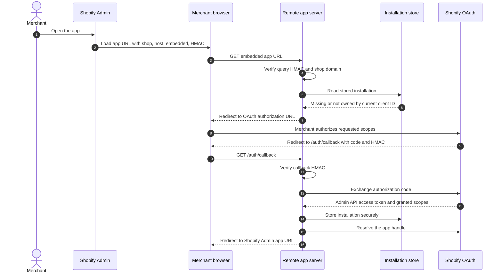
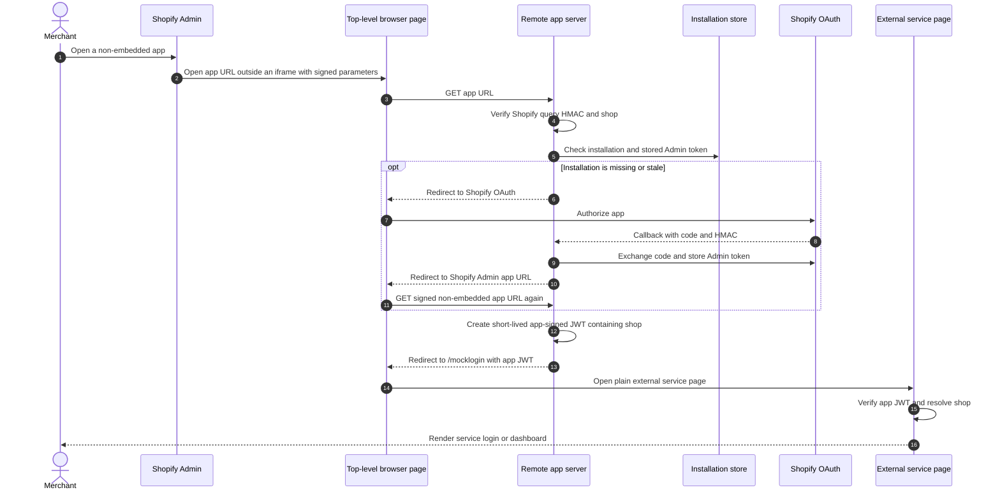
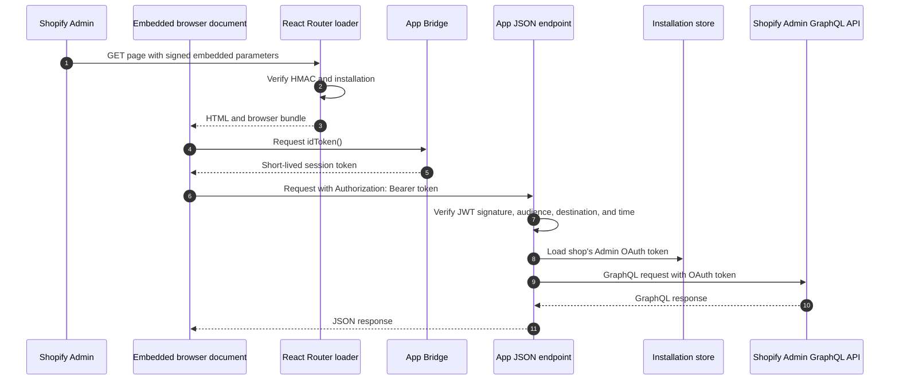
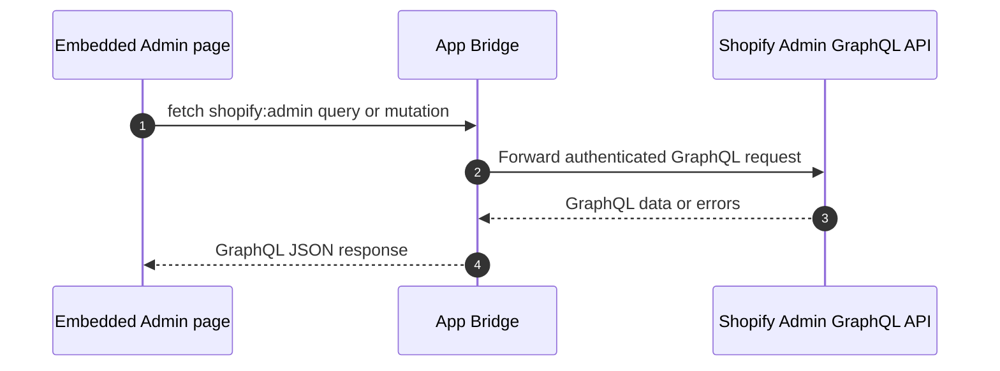
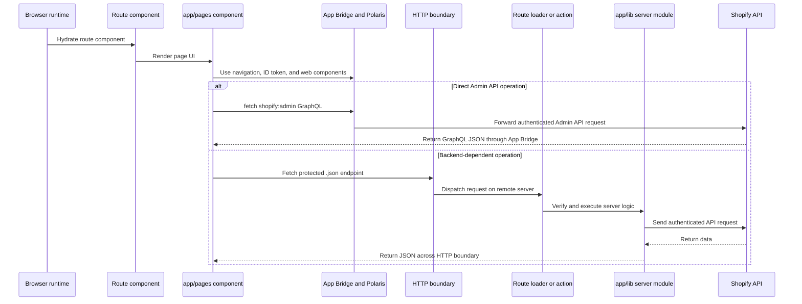
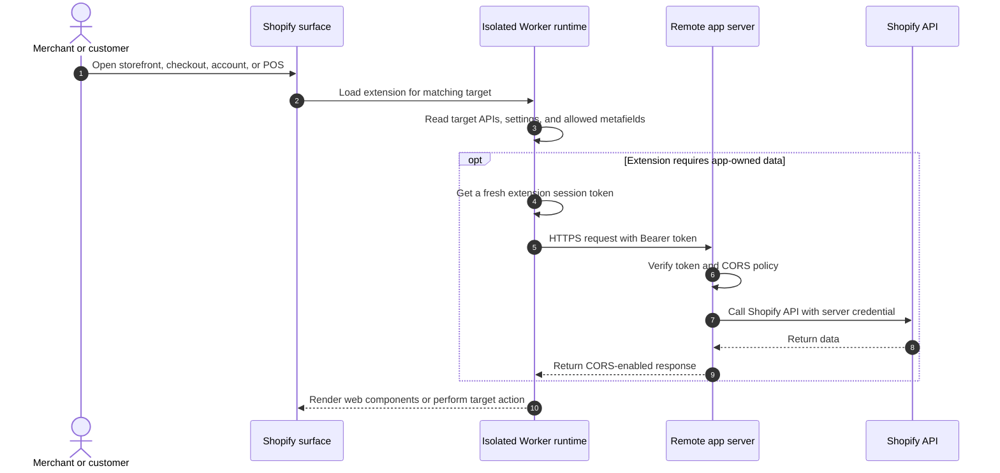
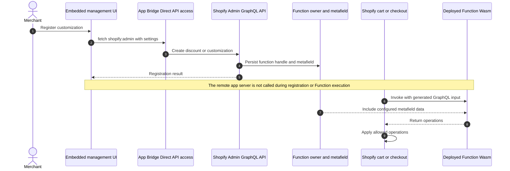

# Application Architecture

This document explains where each part of the sample runs and how requests move between Shopify, the browser, the app server, and deployed extensions. The sample uses Node.js, React Router, and Render, but the security and protocol boundaries apply equally to apps written in other languages or hosted elsewhere.

## Runtime Map

| Area | Runs in | Responsibility |
| --- | --- | --- |
| React route `loader` and `action` functions | Remote app server | Verify requests, load installation data, call Shopify APIs, and return HTTP responses |
| React route components and `app/pages/` | Merchant browser | Render the embedded App Home UI and initiate authenticated requests |
| `app/lib/*.server.js` | Remote app server | OAuth, JWT/HMAC verification, token storage, GraphQL calls, webhook handling, and business logic |
| `app/utils/` | Merchant browser unless otherwise noted | App Bridge access, session-token fetches, navigation, and browser helpers |
| App Bridge and Polaris web components | Merchant browser inside Shopify Admin | Embed the app, provide Shopify context, navigation, and Admin UI components |
| Theme app extension | Online Store theme runtime and storefront browser | Render Liquid blocks and run storefront JavaScript |
| Checkout, Customer Account, and POS UI extensions | Isolated Shopify-hosted extension sandboxes in the surface's browser or app | Execute bundled JavaScript in Web Worker-based runtimes, communicate through remote-dom, and use target APIs supplied by Shopify |
| Web Pixel app extension | Strict Web Worker sandbox in the visitor's browser | Subscribe to permitted customer events and send analytics requests without direct DOM access |
| Shopify Functions | Shopify infrastructure | Run deterministic WebAssembly (Wasm) modules during cart and checkout processing |
| Post-purchase extension | Shopify-hosted Web Worker-based post-purchase runtime | Render remote UI after checkout and request a signed order change |

React Router route modules can contain both server and browser code. A route's `loader` and `action` execute on the app server, while its default React component and imported page components can be included in the browser bundle. The `.server.js` suffix makes the server-only boundary explicit.

## First Embedded Access and OAuth

The Admin initially opens the app with a Shopify-signed query. The app verifies that query before trusting `shop`, checks whether the installation belongs to the current app client, and starts OAuth when an Admin API access token is missing or stale.

The OAuth access token belongs on the server. App Bridge session tokens are short-lived browser-to-app assertions and are not substitutes for the stored Admin API token.

## Non-embedded Service Connector

When the app configuration uses `embedded = false`, Shopify opens App Home as a top-level external page instead of inside the Admin iframe. App Bridge and its session-token API are unavailable in that page, so this sample verifies the signed Shopify entry request, completes OAuth if necessary, and then issues a separate short-lived JWT owned by the app. The JWT carries the verified shop identity to the dummy external service page.

The sample hosts `/mocklogin` on the same server, but it represents a separate external system in this architecture. The app-owned JWT is not a Shopify session token and does not grant Admin API access. A production connector should use the verified shop to establish its own server-side session, keep the handoff token short-lived and single-purpose, and avoid retaining it in URLs or logs. This differs from the embedded Session Token page's connector demonstration, where App Bridge supplies a Shopify-signed session token before opening the external page.

## Normal Embedded Page and Server-backed API Request

After installation, the signed initial page request establishes the embedded document. Browser-side code then obtains a fresh App Bridge token for each protected app-server request. This flow remains in use when a feature needs application secrets, stored installation data, external integrations, or server-side orchestration.

The initial HMAC and later JWT solve different problems:

- The query HMAC protects the server-rendered entry request from forged Shopify parameters.
- The session-token JWT authenticates a browser or extension request to the app server.
- The offline Admin OAuth token authorizes the app server to call the Admin API for that shop.

## Direct Admin API Request

The Admin Link product query and the merchant-triggered Function, Web Pixel, and post-purchase setup operations use the App Bridge Resource Fetching API and the `shopify:admin` URL scheme. Shopify authenticates these GraphQL requests without sending them through the app server. The deployed app configuration must enable Direct API access and declare the required Admin API scopes.

This flow does not expose an Admin access token to the browser. It removes the need for one-purpose app-server endpoints for these operations, but it does not replace server routes used by OAuth, the non-embedded Service Connector, App Proxy, webhooks, Storefront token management, post-purchase runtime processing, POS printing, or other backend-dependent samples.

## Browser and Server Module Boundaries

Do not import secrets or server-only modules into page components. Environment variables, OAuth tokens, database access, and Admin API credentials must remain behind the HTTP boundary.

## Storefront and UI Extension Runtimes

Theme, Web Pixel, Checkout UI, Customer Account UI, and POS UI extensions are delivered by Shopify and run on their target surfaces. They do not execute inside the Render process, although selected extensions can call the app server over HTTPS. UI extensions execute in isolated Web Worker-based sandboxes and describe UI through remote-dom rather than directly controlling the host DOM. App Web Pixels run in a strict Web Worker sandbox with no direct DOM access.

Capabilities such as network access, Storefront API access, metafield access, and buyer-journey blocking must be declared in each extension's configuration. Browser or Worker requests can trigger an `OPTIONS` preflight, which the server must answer before routing the actual request. Each placed extension block is an isolated runtime instance, so in-memory state and side effects must not assume one global singleton.

## Shopify Functions Runtime

The management UI registers a Function and its configuration through the Admin API. The Rust source is compiled to a WebAssembly (Wasm) module when the extension is built and deployed. Later, Shopify invokes that module directly while evaluating a cart or checkout; the remote app server is not in that execution path.

Functions must be deterministic and use only the input declared by their input query. They must comply with Shopify's Wasm ABI and resource limits. Logging, arbitrary network calls unless explicitly supported by that Function API, and reading the app database are not part of the normal runtime path.

## Infrastructure Independence

Render, Node.js, React Router, and MongoDB are this repository's concrete choices. Another implementation can replace all of them if it preserves the same contracts:

- Verify Shopify HMAC signatures before trusting signed query strings or webhook bodies.
- Verify session-token JWTs and bind them to the expected app client and shop.
- Keep Admin and private Storefront access tokens on a trusted server.
- Implement the OAuth callback and persist installation state safely.
- Return correct content types, CORS headers, status codes, and response shapes.
- Treat extension configuration and deployed artifacts as part of the app version.

## Source Map

| Concern | Source |
| --- | --- |
| Route definitions | [`app/routes.js`](../app/routes.js) |
| HTML shell and conditional App Bridge loading | [`app/root.jsx`](../app/root.jsx) |
| Embedded navigation | [`app/AppShell.jsx`](../app/AppShell.jsx) |
| Initial authentication and OAuth start | [`app/routes/auth.jsx`](../app/routes/auth.jsx) |
| OAuth callback | [`app/routes/auth.callback.jsx`](../app/routes/auth.callback.jsx) |
| Non-embedded JWT handoff | [`app/routes/auth.jsx`](../app/routes/auth.jsx) and [`app/lib/public-endpoints.server.js`](../app/lib/public-endpoints.server.js) |
| Embedded and authenticated endpoint helpers | [`app/lib/embedded.server.js`](../app/lib/embedded.server.js) |
| Session-token verification | [`app/lib/session-token.server.js`](../app/lib/session-token.server.js) |
| Browser App Bridge helpers | [`app/utils/app-bridge.js`](../app/utils/app-bridge.js) |
| Browser Direct Admin API helper | [`app/utils/direct-admin-graphql.js`](../app/utils/direct-admin-graphql.js) |
| Shopify GraphQL client | [`app/lib/shopify-graphql.server.js`](../app/lib/shopify-graphql.server.js) |

## Official References

- [App surfaces](https://shopify.dev/docs/apps/build/app-surfaces)
- [OAuth authorization code grant](https://shopify.dev/docs/apps/build/authentication-authorization/access-tokens/authorization-code-grant)
- [Session tokens](https://shopify.dev/docs/apps/build/authentication-authorization/session-tokens)
- [App Bridge](https://shopify.dev/docs/api/app-bridge-library)
- [App Bridge Resource Fetching API](https://shopify.dev/docs/api/app-home/apis/authentication-and-data/resource-fetching-api)
- [Using Polaris web components and the UI extension execution model](https://shopify.dev/docs/api/polaris/using-polaris-web-components)
- [Web pixel strict sandbox](https://shopify.dev/docs/apps/build/marketing-analytics/pixels)
- [Shopify Functions](https://shopify.dev/docs/api/functions/latest)
- [Authenticate extension requests to an app server](https://shopify.dev/docs/apps/build/purchase-options/product-subscription-app-extensions/authenticate-extension-requests)
