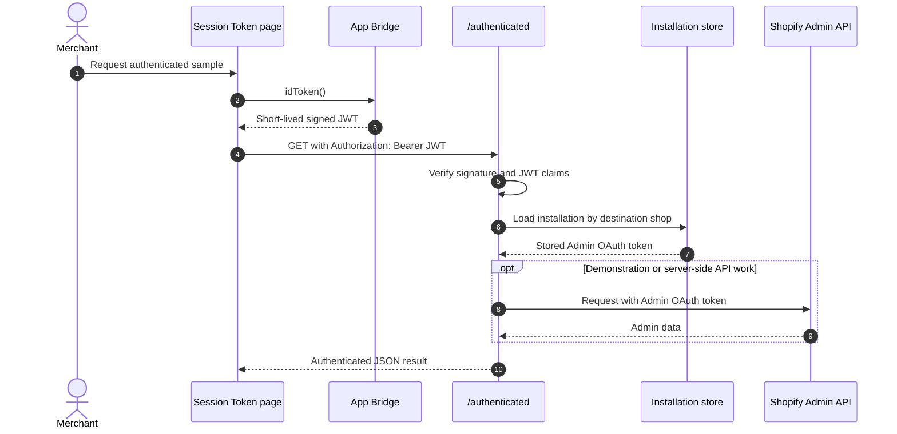

# Session Token

## Purpose

The `/sessiontoken` sample demonstrates how an embedded browser proves its current Shopify identity to the app server. It also contrasts that short-lived proof with the long-lived Admin OAuth token stored by the server.

For the shared embedded-app entry flow, see [Application Architecture](00-ARCHITECTURE.md).

## Runtime Locations

- App Bridge obtains a session token in the embedded browser.
- The app server verifies the JWT and reads the installation record.
- Shopify issues both the session token and the OAuth access token, but they authorize different hops.

## Request Sequence

## How It Works

`authenticatedFetch()` obtains a fresh token from `window.shopify.idToken()` and sends it as a Bearer token. `requireAuthenticatedShop()` verifies that token, derives the shop from its destination claim, and rejects installations that are missing or belong to a different app client. Only after those checks does server code use the stored Admin OAuth token.

The sample also exposes `/mocklogin` to demonstrate a service-connector pattern. The embedded app can pass a session token to that endpoint, and the server can use the verified shop identity to issue its own service-specific login or JWT. In production, avoid putting reusable credentials in URLs because URLs can appear in history and logs.

## Common Pitfalls

- A session token is not an Admin API access token. Sending it to Admin GraphQL will fail.
- Session tokens expire quickly. Get a new token immediately before each app-server request.
- Decoding a JWT is not verification. Validate its signature, audience, destination, and time claims on the server.
- Do not trust a browser-provided `shop` value independently of the verified token.
- An OAuth token from an earlier app client ID must not be reused after the app credentials change.

## Key Terms

| Term | Meaning |
| --- | --- |
| Session token | A short-lived JWT issued for the current embedded app user and shop |
| ID token | The App Bridge method name used by this sample to obtain the session token |
| Offline Admin token | A server-held OAuth token used to call Admin APIs without depending on one browser session |
| Bearer token | The HTTP `Authorization` scheme used for browser-to-app authentication |
| `dest` claim | The JWT claim identifying the Shopify shop for which the token was issued |

## Source Map

- [`app/pages/SessionToken.jsx`](../app/pages/SessionToken.jsx): browser UI and sample requests
- [`app/routes/sessiontoken.jsx`](../app/routes/sessiontoken.jsx): embedded page loader
- [`app/routes/authenticated.jsx`](../app/routes/authenticated.jsx): protected demonstration endpoint
- [`app/routes/mocklogin.jsx`](../app/routes/mocklogin.jsx): external service login demonstration
- [`app/utils/app-bridge.js`](../app/utils/app-bridge.js): App Bridge token and authenticated fetch helpers
- [`app/lib/session-token.server.js`](../app/lib/session-token.server.js): server verification and installation lookup
- [`app/lib/shopify-auth.server.js`](../app/lib/shopify-auth.server.js): JWT and shop helpers

## Official Shopify References

- [Session tokens](https://shopify.dev/docs/apps/build/authentication-authorization/session-tokens)
- [Authenticate requests from Shopify embedded apps](https://shopify.dev/docs/apps/build/authentication-authorization/session-tokens/set-up-session-tokens)
- [OAuth authorization code grant](https://shopify.dev/docs/apps/build/authentication-authorization/access-tokens/authorization-code-grant)
- [App Bridge ID token API](https://shopify.dev/docs/api/app-bridge-library/apis/id-token)
