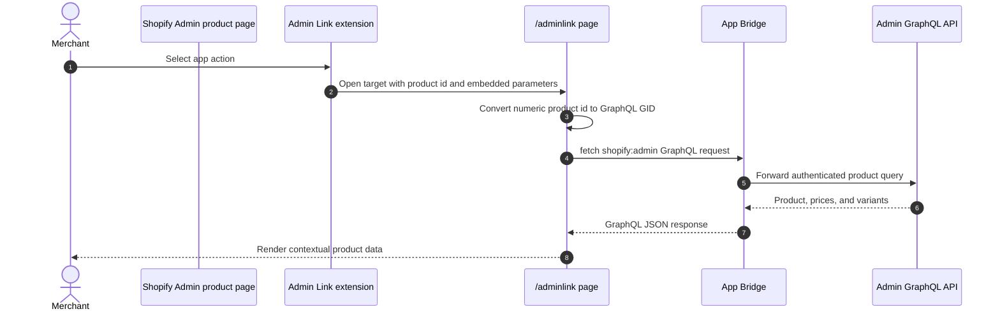

# Admin Link

## Purpose

The `/adminlink` sample connects contextual actions on Shopify Admin product and order detail pages to the app. The product action demonstrates how the destination page receives a resource ID and then uses App Bridge Direct API access to load protected product data without an app-server GraphQL round trip.

## Runtime Locations

- Shopify Admin renders the Admin Link action.
- The link opens the embedded React Router page in the browser.
- The embedded page converts the product ID to a GraphQL global ID.
- App Bridge authenticates and forwards the browser's `shopify:admin` request to Admin GraphQL.

## Request Sequence

## How It Works

The product extension targets `admin.product-details.action.link` and points to `app://adminlink`. Shopify resolves the app URL and appends context, including the selected resource ID. The order extension targets `admin.order-details.action.link` and routes to the order-management sample.

The page calls the standard `fetch()` API with a `shopify:admin/api/{version}/graphql.json` URL. App Bridge intercepts this request and handles Shopify authentication. The page never receives an Admin access token, and the product query does not use the app server or its stored OAuth token.

Direct API access must be enabled in `shopify.app.toml` with `[access.admin].embedded_app_direct_api_access = true`. This sample sets `direct_api_mode = "offline"` to preserve the app-level authorization behavior of the previous server endpoint. Shopify defaults to online mode when the mode is omitted.

## Common Pitfalls

- Admin Link targets and URLs must match the app's embedded setting. A non-embedded app requires an absolute `https` URL instead of an `app://` URL.
- Direct API access works only in the embedded App Bridge context and must be enabled in the deployed app configuration.
- Shopify can provide a numeric resource ID, while Admin GraphQL expects a global ID such as `gid://shopify/Product/...`.
- Pin the `shopify:admin` request to the intended API version instead of relying on an implicit default.
- Direct requests no longer appear in the Render server log. Inspect the browser console entries prefixed with `[shopify-admin-direct]` and the Admin GraphQL response shown on the page.
- Do not expose the Admin OAuth token to the linked page.

## Key Terms

| Term | Meaning |
| --- | --- |
| Admin Link | An extension that adds a contextual link to a supported Shopify Admin resource page |
| Extension target | The named Shopify surface where an extension is mounted |
| `app://` URL | An embedded-app-relative target resolved by Shopify |
| GID | Shopify's GraphQL global identifier format |

## Source Map

- [`extensions/my-admin-link-product-details/shopify.extension.toml`](../extensions/my-admin-link-product-details/shopify.extension.toml): product action target
- [`extensions/my-admin-link-order-details/shopify.extension.toml`](../extensions/my-admin-link-order-details/shopify.extension.toml): order action target
- [`app/pages/AdminLink.jsx`](../app/pages/AdminLink.jsx): browser UI
- [`app/routes/adminlink.jsx`](../app/routes/adminlink.jsx): embedded page route
- [`app/utils/direct-admin-graphql.js`](../app/utils/direct-admin-graphql.js): browser-side Direct Admin API helper

## Official Shopify References

- [Admin UI extensions](https://shopify.dev/docs/api/admin-extensions/latest)
- [Admin extension targets](https://shopify.dev/docs/api/admin-extensions/latest/extension-targets)
- [App Bridge Resource Fetching API](https://shopify.dev/docs/api/app-home/apis/authentication-and-data/resource-fetching-api)
- [App configuration](https://shopify.dev/docs/apps/build/cli-for-apps/app-configuration)
- [GraphQL global IDs](https://shopify.dev/docs/api/usage/gids)
- [Admin GraphQL API](https://shopify.dev/docs/api/admin-graphql/latest)
