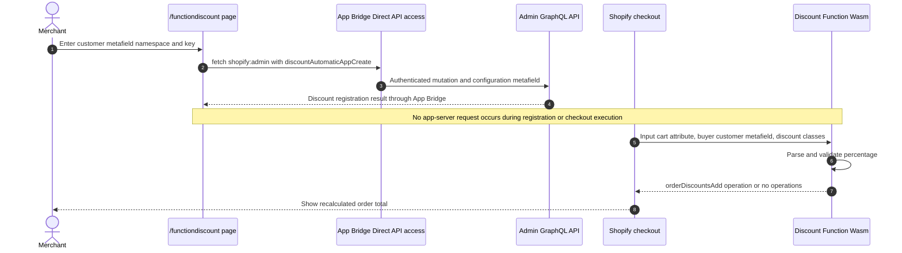

# Function Discount

## Purpose

The `/functiondiscount` sample registers an automatic order-discount Function. At checkout, the Function reads a percentage from a configured customer metafield or a cart attribute and returns an order discount operation.

## Runtime Locations

- The registration form runs in the embedded browser.
- App Bridge Direct API access registers the Function owner and configuration through Admin GraphQL without an app-server API route.
- The Rust Function is compiled to Wasm and runs on Shopify infrastructure.

## Registration and Execution

## How It Works

The Admin mutation registers `my-function-discount-ext` and saves the merchant-selected customer metafield namespace and key in the Function owner's `barebone_app_function_discount.customer_meta` JSON metafield. Shopify uses the Function input query to resolve that dynamic customer metafield.

At runtime, the Function checks that order discounts are supported, prefers the configured cart attribute when present, otherwise reads the logged-in customer's metafield, parses a value greater than zero and no more than 100, and applies that percentage to the order subtotal.

## Common Pitfalls

- Registering the Function and executing it are separate phases. Checkout does not call this app server.
- Direct API registration requires an embedded App Bridge context and the app's configured Direct API access and Admin scopes.
- A customer metafield is available only when checkout has a matching authenticated customer and the Function input query requests it.
- Namespace and key must match the metafield definition and stored customer value exactly.
- Invalid, missing, zero, negative, or greater-than-100 values intentionally return no operations.
- Discount classes and combination settings determine whether an otherwise valid operation can apply.
- Cart attributes are buyer-controlled input; do not use one as an unrestricted discount authority in production.

## Key Terms

| Term | Meaning |
| --- | --- |
| Function handle | Stable extension identifier used by Admin API registration |
| Function owner | The discount or customization resource that stores settings and invokes the Function |
| Input query | GraphQL selection compiled with the Function to define its runtime input |
| Operation | A typed instruction returned to Shopify, such as adding an order discount |
| Wasm | The deployed WebAssembly artifact executed by Shopify |

## Source Map

- [`app/pages/FunctionDiscount.jsx`](../app/pages/FunctionDiscount.jsx): registration UI and `discountAutomaticAppCreate` mutation
- [`app/utils/direct-admin-graphql.js`](../app/utils/direct-admin-graphql.js): shared App Bridge Direct API client
- [`extensions/my-function-discount-ext/src/cart_lines_discounts_generate_run.graphql`](../extensions/my-function-discount-ext/src/cart_lines_discounts_generate_run.graphql): runtime input query
- [`extensions/my-function-discount-ext/src/cart_lines_discounts_generate_run.rs`](../extensions/my-function-discount-ext/src/cart_lines_discounts_generate_run.rs): Function logic and tests
- [`extensions/my-function-discount-ext/shopify.extension.toml`](../extensions/my-function-discount-ext/shopify.extension.toml): extension configuration

## Official Shopify References

- [Discount Function API](https://shopify.dev/docs/api/functions/latest/discount)
- [Create an automatic app discount](https://shopify.dev/docs/api/admin-graphql/latest/mutations/discountAutomaticAppCreate)
- [App Bridge Resource Fetching API](https://shopify.dev/docs/api/app-home/apis/authentication-and-data/resource-fetching-api)
- [Shopify Functions](https://shopify.dev/docs/api/functions/latest)
- [Metafields](https://shopify.dev/docs/apps/build/custom-data/metafields)
