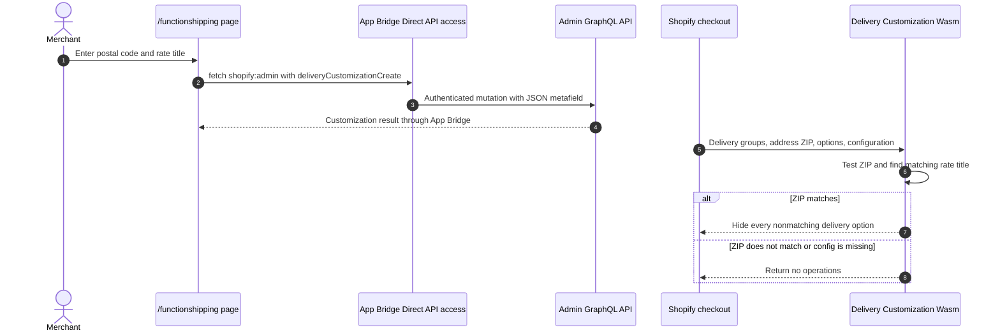

# Function Shipping

## Purpose

The `/functionshipping` sample registers a Delivery Customization Function. When the checkout destination contains the configured postal code, the Function keeps the configured delivery-rate title and hides the other delivery options.

## Runtime Locations

- The merchant configures the sample in the embedded browser.
- App Bridge Direct API access creates the delivery customization through Admin GraphQL without an app-server API route.
- Shopify executes the Rust/Wasm Function while calculating checkout delivery options.

## Registration and Execution

## How It Works

The app registers `my-function-shipping-ext` and stores `{zip, rate}` in `barebone_app_function_shipping.filter`. Its input query asks Shopify for delivery addresses, delivery option handles and titles, and the customization metafield.

If any delivery group has the configured postal code, the Function creates hide operations for options whose titles do not equal the configured title. Returning no operations leaves Shopify's original delivery options unchanged.

## Common Pitfalls

- The configured string must match the delivery option title Shopify provides at runtime.
- Postal-code formats vary by market. Production code should define normalization and matching rules explicitly.
- Hiding the wrong side of the comparison reverses the behavior. The sample hides nonmatching handles, not the configured option.
- A delivery option must exist before a customization can retain it; this Function does not create shipping rates.
- Checkout invokes the Function whenever relevant inputs change, not only after a customer visits the cart page.
- Direct API registration requires an embedded App Bridge context and the app's configured Direct API access and Admin scopes.

## Key Terms

| Term | Meaning |
| --- | --- |
| Delivery customization | An Admin resource that activates a delivery customization Function and stores its settings |
| Delivery group | A set of cart lines and delivery options for one delivery destination |
| Delivery option handle | Runtime identifier used in hide operations |
| Rate title | Buyer-visible delivery option name used by this sample's matching rule |

## Source Map

- [`app/pages/FunctionShipping.jsx`](../app/pages/FunctionShipping.jsx): configuration UI and `deliveryCustomizationCreate` mutation
- [`app/utils/direct-admin-graphql.js`](../app/utils/direct-admin-graphql.js): shared App Bridge Direct API client
- [`extensions/my-function-shipping-ext/src/cart_delivery_options_transform_run.graphql`](../extensions/my-function-shipping-ext/src/cart_delivery_options_transform_run.graphql): runtime input
- [`extensions/my-function-shipping-ext/src/cart_delivery_options_transform_run.rs`](../extensions/my-function-shipping-ext/src/cart_delivery_options_transform_run.rs): filtering logic and tests
- [`extensions/my-function-shipping-ext/shopify.extension.toml`](../extensions/my-function-shipping-ext/shopify.extension.toml): Function target configuration

## Official Shopify References

- [Delivery Customization Function API](https://shopify.dev/docs/api/functions/latest/delivery-customization)
- [Create a delivery customization](https://shopify.dev/docs/api/admin-graphql/latest/mutations/deliveryCustomizationCreate)
- [App Bridge Resource Fetching API](https://shopify.dev/docs/api/app-home/apis/authentication-and-data/resource-fetching-api)
- [Shopify Functions](https://shopify.dev/docs/api/functions/latest)
