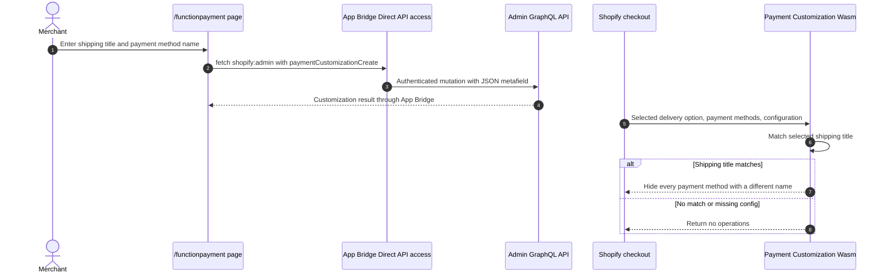

# Function Payment

## Purpose

The `/functionpayment` sample registers a Payment Customization Function. When the checkout's selected shipping method has the configured title, the Function keeps the configured payment method and hides all other payment methods.

## Runtime Locations

- The settings UI runs in the embedded browser.
- App Bridge Direct API access creates the payment customization through Admin GraphQL without an app-server API route.
- Shopify executes the Rust/Wasm Function during payment-method evaluation.

## Registration and Execution

## How It Works

The app registers `my-function-payment-ext` and stores `{rate, method}` in `barebone_app_function_payment.filter`. The input query supplies selected delivery option titles, available payment method IDs and names, and that JSON configuration.

When the configured delivery title is selected, the Function iterates through payment methods and returns `paymentMethodHide` operations for every method whose name does not match the configured method. Shopify operations require payment method IDs; the configured name is only used to find which IDs should remain visible.

## Common Pitfalls

- The operation must hide nonmatching IDs. Hiding the configured method ID produces the opposite result.
- Payment method names and shipping titles must match Shopify's runtime strings exactly.
- IDs can vary by shop and payment setup. Never infer the desired ID from list position or a previous log.
- A customization filters existing methods; it does not activate a gateway or make an ineligible method available.
- If no matching configured method exists, this sample can hide every method after the shipping condition matches. Production logic should choose an explicit fallback.
- Direct API registration requires an embedded App Bridge context and the app's configured Direct API access and Admin scopes.

## Key Terms

| Term | Meaning |
| --- | --- |
| Payment customization | An Admin resource that activates a payment customization Function |
| Selected delivery option | The current shipping choice supplied to the Function input |
| Payment method ID | Runtime global ID required by payment hide operations |
| Payment method name | Buyer-visible name used by this sample to identify the method to retain |

## Source Map

- [`app/pages/FunctionPayment.jsx`](../app/pages/FunctionPayment.jsx): settings UI and `paymentCustomizationCreate` mutation
- [`app/utils/direct-admin-graphql.js`](../app/utils/direct-admin-graphql.js): shared App Bridge Direct API client
- [`extensions/my-function-payment-ext/src/cart_payment_methods_transform_run.graphql`](../extensions/my-function-payment-ext/src/cart_payment_methods_transform_run.graphql): runtime input
- [`extensions/my-function-payment-ext/src/cart_payment_methods_transform_run.rs`](../extensions/my-function-payment-ext/src/cart_payment_methods_transform_run.rs): filtering logic and tests
- [`extensions/my-function-payment-ext/shopify.extension.toml`](../extensions/my-function-payment-ext/shopify.extension.toml): Function target configuration

## Official Shopify References

- [Payment Customization Function API](https://shopify.dev/docs/api/functions/latest/payment-customization)
- [Create a payment customization](https://shopify.dev/docs/api/admin-graphql/latest/mutations/paymentCustomizationCreate)
- [App Bridge Resource Fetching API](https://shopify.dev/docs/api/app-home/apis/authentication-and-data/resource-fetching-api)
- [Shopify Functions](https://shopify.dev/docs/api/functions/latest)
