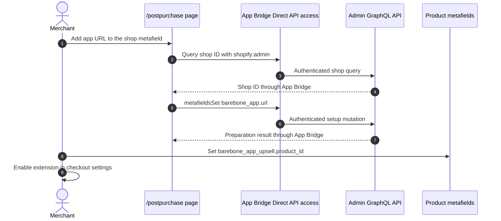
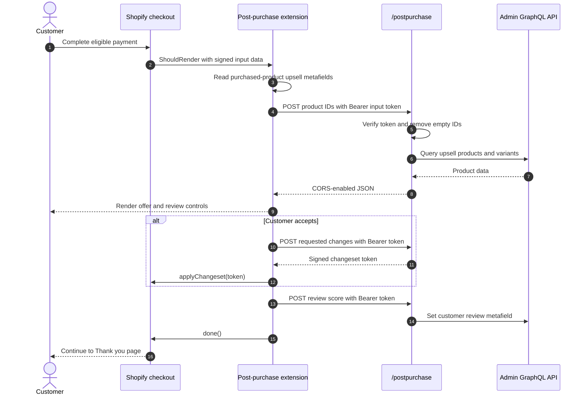

# Post-purchase

## Purpose

The `/postpurchase` sample prepares metafields and server endpoints for an offer shown after payment but before the Thank you page. The extension looks up upsell products, can add accepted variants through a signed changeset, records a customer review score, and then completes the post-purchase flow.

## Runtime Locations

- The preparation UI runs in the embedded Admin app.
- App Bridge Direct API access writes the shop-level setup metafield without an app-server setup route.
- The post-purchase extension runs in Shopify's dedicated Web Worker-based post-purchase runtime and renders Shopify-provided remote UI rather than the host DOM.
- Product lookup, changeset signing, and customer metafield updates run on the remote app server.
- Shopify applies the signed changeset to the completed purchase.

## Preparation Sequence

## Buyer Sequence

## How It Works

`Checkout::PostPurchase::ShouldRender` receives purchase input, reads each purchased product's `barebone_app_upsell.product_id`, and fetches corresponding product data from the app server. The response is stored for `Checkout::PostPurchase::Render`.

When the buyer accepts, the extension builds `add_variant` changes. The app server signs those changes with the app secret and purchase reference, and Shopify applies the resulting token. The review score is written to `barebone_app_review.score` after the server derives the customer from the verified token. Calling `done()` is what releases the buyer to the next checkout page.

The app handles `OPTIONS /postpurchase` before React Router. Extension runtimes often trigger a CORS preflight, so the actual `POST` is never sent if the preflight fails.

Only the merchant-facing setup action uses Direct API access. Product lookup, changeset signing, and customer review updates remain on the app server because they process verified post-purchase tokens and, for signing, require the app secret.

## Common Pitfalls

- Post-purchase eligibility has payment-method and checkout limitations; the extension is not guaranteed to appear after every order.
- Product metafield values can be missing, producing `null` entries. Filter them before building the Admin search query.
- A `ShouldRender` result without usable stored product data can flash an empty page and immediately continue.
- The Bearer input token must be verified before deriving shop, purchase, or customer identity.
- CORS requires the preflight response, allowed headers, and actual response headers to agree.
- Never let the browser sign its own changeset; signing requires the app secret.
- `done()` must be called after both acceptance and rejection paths.
- Direct API setup requires an embedded App Bridge context and the app's configured Direct API access and Admin scopes.

## Key Terms

| Term | Meaning |
| --- | --- |
| `ShouldRender` | Pre-render target that decides whether the post-purchase page should appear |
| `Render` | Target that displays the post-purchase offer |
| Changeset | A list of supported changes to the completed checkout |
| Changeset token | App-signed JWT authorizing Shopify to apply those changes |
| Input token | Shopify-signed token containing trusted post-purchase context |

## Source Map

- [`app/pages/PostPurchase.jsx`](../app/pages/PostPurchase.jsx): setup UI, shop query, and `metafieldsSet` mutation
- [`app/utils/direct-admin-graphql.js`](../app/utils/direct-admin-graphql.js): shared App Bridge Direct API client
- [`app/routes/postpurchase.jsx`](../app/routes/postpurchase.jsx): extension-facing action route
- [`app/lib/post-purchase.server.js`](../app/lib/post-purchase.server.js): product lookup, token signing, and review update
- [`server.mjs`](../server.mjs): early CORS preflight handling
- [`extensions/my-post-purchase-ext/src/index.jsx`](../extensions/my-post-purchase-ext/src/index.jsx): post-purchase targets and offer UI
- [`extensions/my-post-purchase-ext/shopify.extension.toml`](../extensions/my-post-purchase-ext/shopify.extension.toml): extension and metafield configuration

## Official Shopify References

- [Post-purchase extensions](https://shopify.dev/docs/apps/build/checkout/product-offers)
- [App Bridge Resource Fetching API](https://shopify.dev/docs/api/app-home/apis/authentication-and-data/resource-fetching-api)
- [Post-purchase extension points](https://shopify.dev/docs/api/checkout-extensions/extension-points)
- [Post-purchase JWT specification](https://shopify.dev/docs/api/checkout-extensions/post-purchase/jwt-specification)
- [Post-purchase limitations and considerations](https://shopify.dev/docs/apps/checkout/post-purchase#limitations-and-considerations)
- [Checkout network access](https://shopify.dev/docs/apps/build/checkout/capabilities#network-access)
