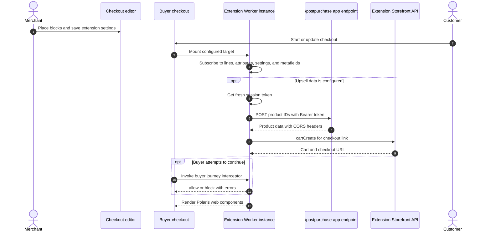
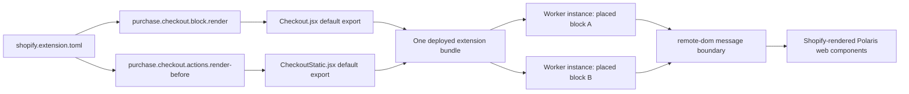

# Checkout UI

## Purpose

The `/checkoutui` page describes three Checkout UI extension packages. Together they demonstrate upsells, Storefront API access, app-server access, cart and checkout state subscriptions, customer review handling, address suggestions, buyer-journey blocking, cart-line changes, and Polaris web components rendered with Preact.

## Runtime Locations

- The management page runs inside the embedded app.
- Merchants place extension blocks and configure settings in the checkout editor.
- Extension modules run as bundled JavaScript in isolated Web Worker-based sandboxes. Shopify renders their Polaris web components in the checkout host through remote-dom.
- Upsell and review flows call the remote app server with extension session tokens.

## Checkout Sequence

## Included Extension Packages

| Package | Targets and behavior |
| --- | --- |
| `my-checkout-ui-ext` | Dynamic upsell block, checkout validation, review UI, address autocomplete, Storefront API calls, cart changes, and app-server requests |
| `my-checkout-ui-ext-2` | Reactive metafield, cart-attribute, and discount-code samples at dynamic and static targets; includes alternate vanilla JavaScript source for comparison |
| `my-checkout-ui-ext-3` | Minimal block with `block_progress` capability used to demonstrate mobile checkout summary behavior without visible UI |

## Target, Module, and Worker Relationship

Each target declaration maps to one module entry point, and each module exposes one default registration function for that target. Source files imported by those entry points are bundled with the extension. Placing the same dynamic block more than once creates independent runtime instances from the same bundle; each instance can subscribe and render separately. Shared source code is achieved through normal imports, not by declaring duplicate target entries.

## Differences from the Wiki Deep Dive

The Wiki remains useful for understanding repeated execution, feedback loops, asynchronous writes, and Worker isolation, but some implementation names reflect an older Checkout UI Extension generation. Read them as the following current equivalents:

| Deep-dive wording or pattern | Current sample |
| --- | --- |
| React and `useXXX()` extension hooks | Preact components and hooks around the global `shopify` target API signals such as `api.appMetafields.value` |
| Remote UI components | Polaris web components with `s-` tags, transported through remote-dom |
| Multiple registered target functions in one entry source | One default module entry point per target for API versions 2025-10 and later; shared components and helpers can still be imported or exported between files |
| React re-render caused by referenced hooks | Preact re-render from state or signal-backed values, plus explicit `.subscribe()` callbacks in the vanilla JavaScript comparison |
| Local-storage-style cache description | The extension Storage API; use its documented scope and lifecycle rather than relying on direct browser `localStorage` behavior |

This repository's `Checkout.jsx`, `CheckoutStatic.jsx`, and TOML target declarations are therefore the source of truth for the modernized implementation. The Wiki explains why those guards and file boundaries exist.

## How It Works

The primary upsell module reads `barebone_app.url` and `barebone_app_upsell.product_id` from the metafields declared in its TOML file. Because subscribed values can initially be empty and can update repeatedly, effects guard against missing values and must remain idempotent. Product data comes from the shared `/postpurchase` server endpoint. The module can then create a separate Storefront API cart link or add a selected variant to the active checkout.

The validation module uses checkout settings for an IP address, blocking message, and quantity threshold. Its buyer-journey interceptor returns `{behavior: 'block'}` only when a configured condition is active; otherwise it returns `{behavior: 'allow'}`. Address autocomplete is a target function that returns a bounded list of structured suggestions rather than rendering a normal block.

Capabilities in `shopify.extension.toml` are part of the security model. Code alone cannot grant network access, Storefront API access, or checkout blocking.

## Reactive and Asynchronous Behavior

The deep-dive sample in `my-checkout-ui-ext-2` demonstrates that checkout signals such as app metafields, cart attributes, discount codes, settings, and lines are reactive. Values can be empty during an early render and can change later, causing the Preact component or a subscription callback to run again. Effects should depend on the values they consume, guard incomplete data, and remain idempotent.

Reading and writing the same checkout value can form a feedback loop. For example, observing a discount code and then unconditionally writing the related cart attribute triggers another update, which can trigger another write. Prefer separating reads and writes behind an explicit buyer action. When synchronization is required, compare the current and desired values and use extension storage or another stable guard so an already-applied update is not repeated.

Most write APIs return Promises. A Preact component must stay synchronous; perform asynchronous work in an event callback, an effect, or a separate async function. Independent reads can run in parallel, but dependent or costly writes such as repeated cart-line and attribute changes should be sequenced and their result types checked. Starting several Promise-returning writes in `map()` without awaiting them does not guarantee execution order and can overload the extension API.

## Common Pitfalls

- Deploying an extension does not place a checkout block. Add it through the checkout editor.
- Availability of checkout customization features depends on the merchant's plan and the target capability.
- Extension data is reactive and may be empty on the first render. Avoid one-time assumptions and duplicate side effects.
- One placed block is not a global singleton. Multiple placements create isolated Worker instances and multiply subscriptions, renders, network requests, and side effects unless they are guarded.
- Reading and unconditionally writing the same reactive value can create an infinite update loop. Compare values and cache completed synchronization when necessary.
- Preact components cannot be `async`. Put `await` inside event handlers, effects, or helper functions, and sequence dependent writes explicitly.
- `buyerJourney.intercept` takes a callback. Passing a result object directly causes a runtime type error.
- A green informational message does not override a separately active blocker; derive UI text from the same state used by the interceptor.
- External `fetch` requires declared network access and a successful CORS preflight.
- Storefront API access in an extension is not an Admin API credential.
- Use Shopify's web components; arbitrary DOM UI is not the extension rendering contract.

## Key Terms

| Term | Meaning |
| --- | --- |
| Target | Named checkout location and lifecycle where a module executes |
| Static target | Fixed checkout location selected by the target definition |
| Dynamic block target | Merchant-placeable checkout block such as `purchase.checkout.block.render` |
| Capability | Explicit permission such as network access, Storefront API access, or block progress |
| Target API | Shopify-provided state and actions exposed to one extension target |
| Buyer journey interceptor | Callback that can allow or block progress when the capability permits it |
| Web Worker instance | Isolated execution instance created for one placed extension block or target occurrence |
| remote-dom | Message-based rendering boundary that lets Shopify render extension web components without giving the extension direct host DOM access |
| Signal | Reactive target API value whose `.value` can change and trigger Preact updates or subscription callbacks |
| Idempotency | Designing an effect so repeated execution does not duplicate its business result |

## Source Map

- [`app/pages/CheckoutUi.jsx`](../app/pages/CheckoutUi.jsx): management instructions
- [`app/routes/checkoutui.jsx`](../app/routes/checkoutui.jsx): embedded page route
- [`extensions/my-checkout-ui-ext/shopify.extension.toml`](../extensions/my-checkout-ui-ext/shopify.extension.toml): targets, capabilities, settings, and metafields
- [`extensions/my-checkout-ui-ext/src/Upsell.jsx`](../extensions/my-checkout-ui-ext/src/Upsell.jsx): upsell and cart behavior
- [`extensions/my-checkout-ui-ext/src/Review.jsx`](../extensions/my-checkout-ui-ext/src/Review.jsx): review and cart/customer state sample
- [`extensions/my-checkout-ui-ext/src/Validation.jsx`](../extensions/my-checkout-ui-ext/src/Validation.jsx): buyer-journey blocking and quantity handling
- [`extensions/my-checkout-ui-ext/src/Address.jsx`](../extensions/my-checkout-ui-ext/src/Address.jsx): address suggestions
- [`extensions/my-checkout-ui-ext-2/src/Checkout.jsx`](../extensions/my-checkout-ui-ext-2/src/Checkout.jsx): Preact reactive data sample
- [`extensions/my-checkout-ui-ext-2/src/Checkout.js`](../extensions/my-checkout-ui-ext-2/src/Checkout.js): vanilla JavaScript comparison
- [`extensions/my-checkout-ui-ext-3/src/Checkout.jsx`](../extensions/my-checkout-ui-ext-3/src/Checkout.jsx): minimal invisible block
- [Checkout UI Extension Integration Deep Dive](../../../wiki/Checkout-UI-Extension-Integration-Deep-Dive): repository Wiki discussion of reactive execution, async APIs, targets, and Worker isolation

## Official Shopify References

- [Checkout UI extensions](https://shopify.dev/docs/api/checkout-ui-extensions/latest)
- [Using Polaris web components and the UI extension execution model](https://shopify.dev/docs/api/polaris/using-polaris-web-components)
- [Checkout block target](https://shopify.dev/docs/api/checkout-ui-extensions/latest/targets/checkout/block)
- [Checkout capabilities](https://shopify.dev/docs/apps/build/checkout/capabilities)
- [Block checkout progress](https://shopify.dev/docs/apps/build/checkout/capabilities#block-progress)
- [Storefront API access](https://shopify.dev/docs/apps/build/checkout/capabilities#storefront-api-access)
- [Network access](https://shopify.dev/docs/apps/build/checkout/capabilities#network-access)
- [Migrate Checkout UI extensions to web components](https://shopify.dev/docs/apps/build/checkout/migrate-to-web-components)
- [Web Workers API](https://developer.mozilla.org/en-US/docs/Web/API/Web_Workers_API)
