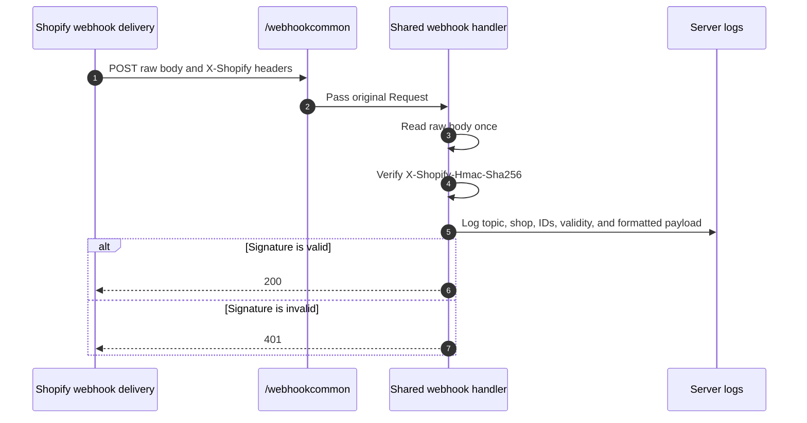

# Event Subscription and Webhooks

## Purpose

The `/eventsubscription` page documents the sample's HTTP event receivers. The implemented mechanism is app-configured Shopify webhooks. The page also points to the next-generation Events and Event subscriptions developer preview, which is not implemented in this repository.

## Runtime Locations

- Shopify sends webhook HTTP requests from Shopify infrastructure.
- The remote app server reads the raw request body, verifies the webhook HMAC, logs metadata and the formatted payload, and acknowledges the delivery.
- The embedded page only explains configuration; it is not involved in delivery.

## Webhook Sequence



## Example App Configuration

An app can configure operational and compliance topics in its app TOML and deliver them to the shared route:

```toml
[[webhooks.subscriptions]]
topics = [ "inventory_levels/update", "carts/update", "carts/create" ]
uri = "/webhookcommon"
compliance_topics = [ "customers/data_request", "customers/redact", "shop/redact" ]
```

This is an example rather than a required subscription set. A real app should choose topics, scopes, API version, filters, and delivery URIs based on its own data flow.

## Receivers in This Sample

| Endpoint | Role |
| --- | --- |
| `/webhookcommon` | Shared receiver for configured operational and compliance webhook topics |
| `/webhookgdpr` | Alternative compliance route delegating to the same handler |
| `/fulfillment_order_notification` | Dedicated fulfillment-service callback that verifies and logs the request, acknowledges immediately, and processes fulfillment requests in the background |
| `/flowaction` | Compatibility receiver for a Shopify Flow action request; no Flow extension is configured here |
| `/fetch_tracking_numbers.json` | Fulfillment-service tracking callback, not a webhook subscription |
| `/fetch_stock.json` | Fulfillment-service stock callback, not a webhook subscription |

## How It Works

HMAC verification must use the exact raw bytes received. Parsing JSON and then serializing it again can change whitespace or key order and invalidate an otherwise genuine delivery. After verification, the shared webhook routes parse JSON for readable two-space-indented logging and return `200`; invalid signatures receive `401`.

The fulfillment-service notification route also returns `200` immediately. It then uses a background job to query requested fulfillment orders, accept them, wait five seconds so the Admin status transition can be observed, and create fulfillments. The short in-process delay is for this hosted sample only; production apps should persist jobs in a durable queue before acknowledging work that must survive a process restart.

The Events developer preview introduces more selective event definitions and payloads. Classic webhooks remain the working delivery mechanism in this sample, so do not infer an Events subscription from the menu name.

## Common Pitfalls

- Do not run JSON parsing or body middleware before preserving the raw body needed for HMAC verification.
- Return a success response quickly and move expensive processing to a durable asynchronous job in production.
- Expect retries and duplicate deliveries; use the webhook or event ID for idempotency.
- Verify the HMAC even when the endpoint URL is difficult to guess.
- Full payload logging can expose customer, order, or compliance data. It is for demonstration and controlled debugging only.
- App-configured webhook changes take effect through app configuration deployment, not merely by editing a local example.

## Key Terms

| Term | Meaning |
| --- | --- |
| Topic | Shopify event category subscribed to by the app |
| Compliance webhook | Mandatory privacy lifecycle delivery for applicable distributed apps |
| Raw body | Exact request bytes used for signature verification |
| HMAC | Message authentication code proving the body was signed with the app secret |
| Idempotency | Processing repeated delivery attempts without duplicating business effects |
| Event subscription | Next-generation developer-preview model distinct from classic webhooks |

## Source Map

- [`app/pages/EventSubscription.jsx`](../app/pages/EventSubscription.jsx): configuration example and endpoint inventory
- [`app/routes/eventsubscription.jsx`](../app/routes/eventsubscription.jsx): embedded information page
- [`app/routes/webhook-action.jsx`](../app/routes/webhook-action.jsx): shared webhook route
- [`app/routes/webhookgdpr.jsx`](../app/routes/webhookgdpr.jsx): alternative compliance route
- [`app/routes/fulfillment-order-notification.jsx`](../app/routes/fulfillment-order-notification.jsx): fulfillment notification route
- [`app/routes/flowaction.jsx`](../app/routes/flowaction.jsx): Flow compatibility route
- [`app/lib/public-endpoints.server.js`](../app/lib/public-endpoints.server.js): raw-body verification and logging

## Official Shopify References

- [About Events and webhooks](https://shopify.dev/docs/apps/build/events-webhooks)
- [Configure app-specific webhook subscriptions](https://shopify.dev/docs/apps/build/webhooks/subscribe)
- [Verify webhook deliveries](https://shopify.dev/docs/apps/build/webhooks/verify-deliveries)
- [Mandatory compliance webhooks](https://shopify.dev/docs/apps/build/privacy-law-compliance)
