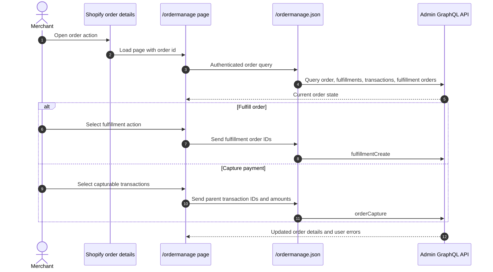
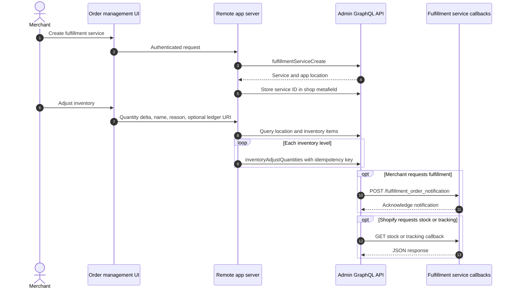
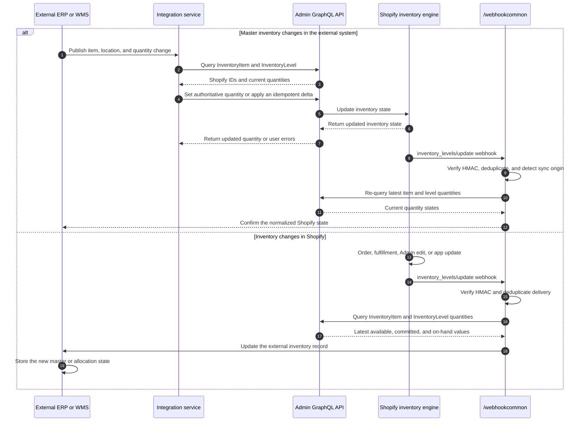

# Order Management

## Purpose

The `/ordermanage` sample combines several Admin API workflows: reading order state, creating fulfillments, capturing authorized transactions, creating a fulfillment service, adjusting inventory at its location, and exposing fulfillment-service callback endpoints.

## Runtime Locations

- The management UI runs in the embedded Admin browser and can also be entered from an order Admin Link.
- The app server performs all Admin GraphQL operations with the stored shop OAuth token.
- Shopify calls fulfillment-service notification, stock, and tracking endpoints from Shopify infrastructure.

## Order Action Sequence

## Fulfillment Service Sequence

## External ERP Inventory Synchronization

When an external ERP, warehouse management system, or other core system is the inventory master, the integration must synchronize changes in both directions. A master quantity change should update the matching Shopify inventory item and location, while an order, fulfillment, Admin edit, or another app that changes Shopify inventory should notify the external system.

For an authoritative ERP snapshot, use an absolute inventory-set operation with compare-and-set protection when practical. Use a delta adjustment only when the external event itself represents a reliable, idempotent quantity change. Shopify can emit `inventory_levels/update` for changes made by this integration as well as changes made elsewhere, so persist event IDs or synchronization metadata and prevent webhook-driven writes from creating an update loop.

### TIPS: Inventory Status Transformation

The normal lifecycle of a unit sold through Shopify is:

`Before checkout: available` -> `After order creation: committed` -> `After fulfillment: removed from on_hand`

- Before checkout, `available` represents inventory that can be sold.
- When the order is created, the ordered quantity moves from `available` to `committed`; total `on_hand` inventory remains unchanged.
- When the order is fulfilled, `committed` and `on_hand` decrease because the physical unit leaves the location. Shopify doesn't expose a separate `fulfilled` inventory state.
- The Admin API can't directly adjust or move `committed`; Shopify changes it through order creation and fulfillment.

Subscribe to the [`inventory_levels/update` webhook](https://shopify.dev/docs/api/admin-graphql/unstable/enums/WebhookSubscriptionTopic#enums-INVENTORY_LEVELS_UPDATE) and treat its payload as a change notification. After verifying the webhook HMAC, query the current [Inventory Item and Inventory Level quantity states](https://shopify.dev/docs/apps/build/orders-fulfillment/inventory-management-apps/manage-quantities-states), then send the latest relevant quantities and status to the external system.

## How It Works

When an order ID is present, the server converts it to a Shopify order GID and queries fulfillment, transaction, and fulfillment-order state. Fulfillment creation uses fulfillment order IDs rather than raw line-item IDs. Payment capture uses each authorization's parent transaction ID and amount.

The fulfillment-service registration returns an app location. The sample stores the service ID in a shop metafield, lets the merchant associate product inventory with that location, and adjusts quantities using `inventoryAdjustQuantities`. Each adjustment includes a UUID idempotency key and explicitly uses `changeFromQuantity: null` to skip a compare-and-set check.

## Common Pitfalls

- Fulfillment orders are the unit used for modern fulfillment workflows; order line items alone are insufficient.
- An order can contain multiple fulfillment orders and multiple transactions with different eligibility states.
- Capture only manually capturable authorization transactions and use the correct parent transaction ID.
- A fulfillment service location must be assigned inventory before quantity adjustment or fulfillment testing is meaningful.
- Inventory adjustment name, reason, and ledger-document requirements depend on the chosen adjustment type.
- Do not send an empty ledger URI; send `null` or omit it where permitted.
- Fulfillment callbacks and webhook deliveries are server-to-server requests and must not depend on an embedded browser session.
- An inventory webhook can be delivered more than once and can be caused by the integration's own write. Deduplicate events and prevent synchronization loops.
- Map inventory by Shopify inventory item and location IDs. A SKU alone might not uniquely identify a location-specific inventory level.

## Key Terms

| Term | Meaning |
| --- | --- |
| Fulfillment order | Shopify's assigned unit of fulfillment work for a location or service |
| Fulfillment service | App-managed service and location that can receive fulfillment requests |
| Authorization transaction | Payment authorization that can later be captured |
| Inventory level | Quantity state for one inventory item at one location |
| Idempotency key | Unique key preventing duplicate mutation effects across retries |
| `changeFromQuantity` | Optional compare-and-set baseline for an inventory quantity change |

## Source Map

- [`app/pages/OrderManage.jsx`](../app/pages/OrderManage.jsx): browser workflows
- [`app/routes/ordermanage.jsx`](../app/routes/ordermanage.jsx): page route and order-link entry
- [`app/routes/ordermanage-json.jsx`](../app/routes/ordermanage-json.jsx): authenticated data route
- [`app/lib/order-and-bulk.server.js`](../app/lib/order-and-bulk.server.js): order, fulfillment service, capture, and inventory GraphQL
- [`app/routes/fulfillment-order-notification.jsx`](../app/routes/fulfillment-order-notification.jsx): fulfillment notification callback
- [`app/routes/fetch-stock.jsx`](../app/routes/fetch-stock.jsx): stock callback
- [`app/routes/fetch-tracking-numbers.jsx`](../app/routes/fetch-tracking-numbers.jsx): tracking callback
- [`app/routes/webhook-action.jsx`](../app/routes/webhook-action.jsx): shared webhook route used by `/webhookcommon`
- [`app/lib/public-endpoints.server.js`](../app/lib/public-endpoints.server.js): webhook HMAC verification, logging, and response handling
- [`extensions/my-admin-link-order-details/shopify.extension.toml`](../extensions/my-admin-link-order-details/shopify.extension.toml): order detail action

## Official Shopify References

- [Fulfillment apps](https://shopify.dev/docs/apps/build/orders-fulfillment/fulfillment-service-apps)
- [Build for fulfillment services](https://shopify.dev/docs/apps/build/orders-fulfillment/fulfillment-service-apps/build-for-fulfillment-services)
- [Inventory management apps](https://shopify.dev/docs/apps/build/orders-fulfillment/inventory-management-apps)
- [Manage inventory quantities and states](https://shopify.dev/docs/apps/build/orders-fulfillment/inventory-management-apps/manage-quantities-states)
- [Inventory level update webhook topic](https://shopify.dev/docs/api/admin-graphql/unstable/enums/WebhookSubscriptionTopic#enums-INVENTORY_LEVELS_UPDATE)
- [Create a fulfillment](https://shopify.dev/docs/api/admin-graphql/latest/mutations/fulfillmentCreate)
- [Adjust inventory quantities](https://shopify.dev/docs/api/admin-graphql/unstable/mutations/inventoryAdjustQuantities)
