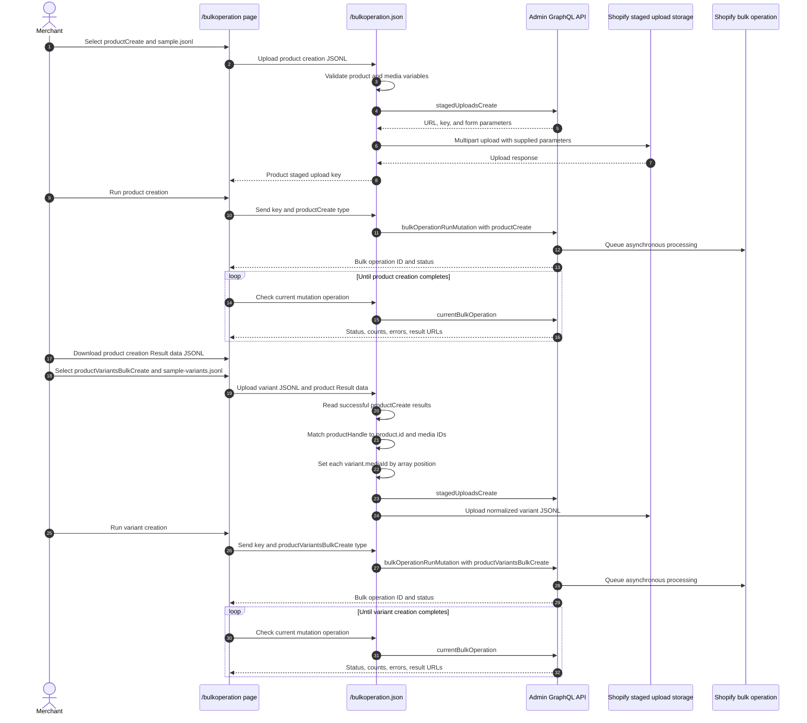

# Bulk Operation

## Purpose

The `/bulkoperation` sample imports products, product images, and different numbers of options and variants per product from JSON Lines files. It demonstrates two dependent Admin GraphQL bulk mutations: [`productCreate`](https://shopify.dev/docs/api/admin-graphql/unstable/mutations/productCreate) creates products with options and media, then [`productVariantsBulkCreate`](https://shopify.dev/docs/api/admin-graphql/unstable/mutations/productVariantsBulkCreate) replaces each initial variant and associates every new variant with one of the created media items. It also demonstrates status polling, result URLs, partial-data URLs, and cancellation.

## Runtime Locations

- The embedded browser submits a JSONL file and the selected operation type to the authenticated app endpoint. A handle-based variant import also submits the Result data JSONL downloaded from the completed product creation operation.
- The app server validates product creation records. For variant records, it matches each `productHandle` to the product ID and ordered media IDs returned in the product creation Result data before creating the staged file.
- The app server uploads the prepared file to Shopify's staged storage and starts, polls, or cancels the selected bulk operation through Admin GraphQL.
- Shopify processes the JSONL file asynchronously.

## Import Sequence



## How It Works

The sample downloads are generated with `.jsonl` filenames so that they remain selectable by the uploader's file filter.

### Product creation format

Select **Create products** and upload `sample.jsonl`. Each JSONL line is one variables object for one [`productCreate`](https://shopify.dev/docs/api/admin-graphql/unstable/mutations/productCreate) invocation, so one line represents one product:

```json
{"product":{"title":"Bulk sample product 3","handle":"bulk-sample-product-3","productOptions":[{"name":"Size","values":[{"name":"Small"},{"name":"Medium"}]},{"name":"Color","values":[{"name":"Red"},{"name":"Blue"}]}]},"media":[{"mediaContentType":"IMAGE","originalSource":"https://cdn.example.com/product-3-1.png"},{"mediaContentType":"IMAGE","originalSource":"https://cdn.example.com/product-3-2.png"},{"mediaContentType":"IMAGE","originalSource":"https://cdn.example.com/product-3-3.png"},{"mediaContentType":"IMAGE","originalSource":"https://cdn.example.com/product-3-4.png"}]}
```

`product` uses [`ProductCreateInput`](https://shopify.dev/docs/api/admin-graphql/unstable/input-objects/ProductCreateInput). Its optional `handle` field can be specified before creation and reused as a stable matching key between the product input, Result data, and variant input. Optional `media` entries use [`CreateMediaInput`](https://shopify.dev/docs/api/admin-graphql/unstable/input-objects/CreateMediaInput), so public image URLs belong in the JSONL file rather than in a separate UI field. Product and media GIDs can't be preassigned in this file; Shopify generates them during creation and returns them in Result data. The bundled sample contains ten products with one, two, or three options and differing variant counts. Each product row has the same number of ordered media entries as its matching variant row, cycling through the five bundled source URLs when necessary.

### Variant creation format

The bundled sample uses position-based media assignment. After product creation completes, download its **Result data**, select **Create product variants**, and upload both `sample-variants.jsonl` and the downloaded Result data JSONL. The native [`productVariantsBulkCreate`](https://shopify.dev/docs/api/admin-graphql/unstable/mutations/productVariantsBulkCreate) mutation requires `productId: ID!` for each product row. The sample upload format can supply that native `productId` directly or use the convenience `productHandle` field so the app can obtain the required GID from Result data. Each row contains one or more [`ProductVariantsBulkInput`](https://shopify.dev/docs/api/admin-graphql/unstable/input-objects/ProductVariantsBulkInput) records, and each variant provides one value for every option defined on that product. The bundled file also sets the sample-specific `assignMediaByPosition` flag:

```json
{"assignMediaByPosition":true,"productHandle":"bulk-sample-product-3","strategy":"REMOVE_STANDALONE_VARIANT","variants":[{"optionValues":[{"optionName":"Size","name":"Small"},{"optionName":"Color","name":"Red"}],"price":"30.00","inventoryItem":{"sku":"BULK-003-S-RED"}},{"optionValues":[{"optionName":"Size","name":"Small"},{"optionName":"Color","name":"Blue"}],"price":"31.00","inventoryItem":{"sku":"BULK-003-S-BLUE"}},{"optionValues":[{"optionName":"Size","name":"Medium"},{"optionName":"Color","name":"Red"}],"price":"32.00","inventoryItem":{"sku":"BULK-003-M-RED"}},{"optionValues":[{"optionName":"Size","name":"Medium"},{"optionName":"Color","name":"Blue"}],"price":"33.00","inventoryItem":{"sku":"BULK-003-M-BLUE"}}]}
```

### Product and media ID mapping modes

Shopify always requires a native `productId` when creating variants, while each variant's native [`mediaId`](https://shopify.dev/docs/api/admin-graphql/unstable/input-objects/ProductVariantsBulkInput) is optional. This sample accepts either a convenience format that resolves generated GIDs from product creation Result data or a native format that supplies those GIDs explicitly:

| File-format element | Position-based mapping used by `sample-variants.jsonl` | Explicit native-ID mapping |
| --- | --- | --- |
| Product selector in the variant JSONL | `productHandle: bulk-sample-product-3` | `productId: gid://shopify/Product/1000000000003` |
| Media-assignment control | `assignMediaByPosition: true` | Omit `assignMediaByPosition` |
| `variants[0]` media field | Omit `mediaId`; the app copies `product.media.nodes[0].id` | Set `mediaId: gid://shopify/MediaImage/2000000000001` explicitly |
| `variants[1]` media field | Omit `mediaId`; the app copies `product.media.nodes[1].id` | Set `mediaId: gid://shopify/MediaImage/2000000000002` explicitly |
| `variants[...]` media field | Continue matching variant and media array positions | Set each desired existing product media GID explicitly; omit `mediaId` for a variant that should have no associated media |
| Product creation Result data JSONL | Required to resolve both `productId` and the ordered media GIDs | Not required when the variant JSONL already contains `productId` and every desired `mediaId` |
| Variables staged for Shopify | The app adds native `productId` and `variants[].mediaId`, then removes `productHandle` and `assignMediaByPosition` | The supplied native `productId` and `variants[].mediaId` values are staged directly |

Position-based assignment associates existing product media with variants; it doesn't upload or duplicate the media again. If `assignMediaByPosition` is enabled, every variant without an existing `mediaId` must have media at the same array position in the Result data. To leave selected variants without media, use the explicit native-ID format and omit `mediaId` from only those variants.

`productId` is required in the native variables sent to [`productVariantsBulkCreate`](https://shopify.dev/docs/api/admin-graphql/unstable/mutations/productVariantsBulkCreate). `productHandle` exists only in this sample's upload format: the app server finds the matching `product.handle` in the uploaded product creation Result data and writes its returned `product.id` to the staged variant JSONL. When `assignMediaByPosition` is true, the app also writes `product.media.nodes[0].id` to `variants[0].mediaId`, the second media ID to the second variant, and so on. Both convenience fields are removed before staging. This avoids synchronous Admin GraphQL lookup requests for individual products or media. A custom variant file that already contains native `productId` and `mediaId` values doesn't require the Result data file. [`REMOVE_STANDALONE_VARIANT`](https://shopify.dev/docs/api/admin-graphql/unstable/enums/ProductVariantsBulkCreateStrategy) removes the single initial variant created by [`productCreate`](https://shopify.dev/docs/api/admin-graphql/unstable/mutations/productCreate) before the new variants are added.

### Product creation Result data

The mutation selection used by this sample returns `product.id`, `product.handle`, `product.title`, and up to 250 `product.media.nodes[].id` values ordered by [`POSITION`](https://shopify.dev/docs/api/admin-graphql/unstable/enums/ProductMediaSortKeys). Shopify writes one response object for every input JSONL line. Each output object also includes `__lineNumber`, which identifies the corresponding zero-based line in the original product creation input. For example:

```json
{"data":{"productCreate":{"product":{"id":"gid://shopify/Product/1000000000003","handle":"bulk-sample-product-3","title":"Bulk sample product 3","media":{"nodes":[{"id":"gid://shopify/MediaImage/2000000000001"},{"id":"gid://shopify/MediaImage/2000000000002"},{"id":"gid://shopify/MediaImage/2000000000003"},{"id":"gid://shopify/MediaImage/2000000000004"}]}},"userErrors":[]}},"__lineNumber":2}
```

The sample matches handles because both bundled files contain the same stable handles. Production import pipelines can retain the original input chunk and use `__lineNumber` as the authoritative correlation key, including when a line fails and has no returned product. The sample builds a product-data map containing the returned product ID and ordered media IDs, then performs an exact match against each variant row's `productHandle`. A missing or different handle, or too few returned media IDs for positional assignment, is rejected before staged upload.

### JSONL row and array mapping

The product creation file is organized as one product per JSONL row:

| JSONL row | Product | Handle | Contents of single line |
| --- | --- | --- | --- |
| Line 1 | Bulk sample product 1 | `product.handle: bulk-sample-product-1` | `Size: Small, Medium, Large`; 3 ordered media entries |
| Line 2 | Bulk sample product 2 | `product.handle: bulk-sample-product-2` | `Color: Black, White`; 2 ordered media entries |
| Line 3 | Bulk sample product 3 | `product.handle: bulk-sample-product-3` | `Size: Small, Medium`; `Color: Red, Blue`; 4 ordered media entries |

The product creation Result data provides the handle check and generated ID handoff:

| Result row | Product | Returned handle | Shopify-generated GID | Ordered media GIDs |
| --- | --- | --- | --- | --- |
| `__lineNumber: 0` | Bulk sample product 1 | `product.handle: bulk-sample-product-1` | `product.id: gid://shopify/Product/1000000000001` | `media.nodes[0..2].id` |
| `__lineNumber: 1` | Bulk sample product 2 | `product.handle: bulk-sample-product-2` | `product.id: gid://shopify/Product/1000000000002` | `media.nodes[0..1].id` |
| `__lineNumber: 2` | Bulk sample product 3 | `product.handle: bulk-sample-product-3` | `product.id: gid://shopify/Product/1000000000003` | `media.nodes[0..3].id` |

The variant creation file is also organized as one product per JSONL row. Variants are array elements within that product's row, conceptually arranged like columns. The GID column below shows the required normalized `productId`; in the bundled position-based input, the app derives this value from `productHandle` and the Result data before staging:

<table>
  <thead>
    <tr>
      <th rowspan="2">JSONL row</th>
      <th rowspan="2">Product</th>
      <th rowspan="2">Handle</th>
      <th rowspan="2">GID (Required)</th>
      <th colspan="4">Contents of single line</th>
    </tr>
    <tr>
      <th><code>variants[0]</code></th>
      <th><code>variants[1]</code></th>
      <th><code>variants[2]</code></th>
      <th><code>variants[...]</code></th>
    </tr>
  </thead>
  <tbody>
    <tr>
      <td>Line 1</td>
      <td>Bulk sample product 1</td>
      <td><code>productHandle: bulk-sample-product-1</code></td>
      <td><code>productId: gid://shopify/Product/1000000000001</code></td>
      <td>Size: Small</td>
      <td>Size: Medium</td>
      <td>Size: Large</td>
      <td>-</td>
    </tr>
    <tr>
      <td>Line 2</td>
      <td>Bulk sample product 2</td>
      <td><code>productHandle: bulk-sample-product-2</code></td>
      <td><code>productId: gid://shopify/Product/1000000000002</code></td>
      <td>Color: Black</td>
      <td>Color: White</td>
      <td>-</td>
      <td>-</td>
    </tr>
    <tr>
      <td>Line 3</td>
      <td>Bulk sample product 3</td>
      <td><code>productHandle: bulk-sample-product-3</code></td>
      <td><code>productId: gid://shopify/Product/1000000000003</code></td>
      <td>Size: Small / Color: Red</td>
      <td>Size: Small / Color: Blue</td>
      <td>Size: Medium / Color: Red</td>
      <td>Size: Medium / Color: Blue</td>
    </tr>
  </tbody>
</table>

All four variants for Bulk sample product 3 must therefore be inside the one `variants: [...]` array on that product's line. Each variant combines one Size value and one Color value; a Variant is not the list of values belonging to a single Option. Don't write those four variants as four separate JSONL lines. Each line invokes [`productVariantsBulkCreate`](https://shopify.dev/docs/api/admin-graphql/unstable/mutations/productVariantsBulkCreate) once for one product, while the nested array creates that product's multiple variants. With `assignMediaByPosition: true`, the four variant columns also receive media IDs 0 through 3 from the matching Result row. The columns can continue as `variants[3]`, `variants[4]`, and so on, and every product row can contain a different number of variants. The sample app doesn't impose an app-specific variant-count cap; Shopify's current mutation and product limits still apply.

Product and variant file row numbers don't need to align because the sample matches them by handle. When a custom variant JSONL already contains `productId` and any required `mediaId` values, the app doesn't need product creation Result data and stages that product-oriented variant row directly after validation. The normalized file sent to Shopify contains native `productId` and `variants[].mediaId` values without the sample-specific `productHandle` or `assignMediaByPosition` fields.

Product and variant creation cannot use one native Shopify JSONL file or one bulk mutation. [`productVariantsBulkCreate`](https://shopify.dev/docs/api/admin-graphql/unstable/mutations/productVariantsBulkCreate) requires a product ID that does not exist until [`productCreate`](https://shopify.dev/docs/api/admin-graphql/unstable/mutations/productCreate) has completed, so the two operations must run sequentially.

Starting [`bulkOperationRunMutation`](https://shopify.dev/docs/api/admin-graphql/unstable/mutations/bulkOperationRunMutation) only queues work. The UI must query [`currentBulkOperation(type: MUTATION)`](https://shopify.dev/docs/api/admin-graphql/unstable/queries/currentBulkOperation) until Shopify reports a terminal state. Completed operations can expose a result file; failed or partially successful operations can expose partial data. Cancellation is also asynchronous and should be followed by another status query.

## Production-scale imports

The in-request parsing in this sample is intended for demonstration-sized files. For hundreds of thousands or millions of products, use a durable import pipeline:

- Split input into chunks comfortably below Shopify's 100 MB JSONL limit and the 24-hour bulk-operation execution limit.
- Store each input chunk, operation ID, stage, and retry state in durable storage instead of browser or server memory.
- Stream input and Result data files rather than loading complete files into memory.
- Detect completion with ID-specific status polling or the [`bulk_operations/finish` webhook](https://shopify.dev/docs/api/admin-graphql/unstable/enums/WebhookSubscriptionTopic#enums-BULK_OPERATIONS_FINISH), then download and retain the temporary Result data before its URL expires.
- Build each variant chunk from the corresponding product creation Result data, using `__lineNumber` or another stable source key to correlate product and media IDs.
- Retry only failed result lines and make retries idempotent so a restarted worker doesn't create duplicate products or variants.
- Schedule within the API-version concurrency limit. API version 2026-01 and later allows up to five concurrent bulk mutation operations per app and shop.

## Common Pitfalls

- Upload success and bulk-operation success are separate events.
- JSONL requires one valid JSON object per line, not a JSON array and not a multiline object.
- Match the selected operation type to the uploaded file format.
- Complete the product operation and download its Result data before uploading a handle-based or positionally media-assigned variant file; missing or failed product results are rejected before staging.
- Use Result data whose `data` object contains [`productCreate`](https://shopify.dev/docs/api/admin-graphql/unstable/mutations/productCreate). Result data containing [`productVariantsBulkCreate`](https://shopify.dev/docs/api/admin-graphql/unstable/mutations/productVariantsBulkCreate) comes from the second operation and can't resolve product handles, product IDs, or media IDs.
- `assignMediaByPosition` requires a same-position returned media ID for every variant that doesn't already have `mediaId`; otherwise staging is rejected.
- Variant records can use native `productId` and `mediaId` values instead of the sample-specific mapping fields, in which case no product creation Result data is required.
- Every variant must provide one value for every option defined on its product. For example, a product with Size and Color options needs both a Size value and a Color value in each variant's `optionValues`.
- Variant arrays can continue beyond three records, but Shopify's current mutation and per-product limits still apply.
- Product image URLs must be reachable by Shopify over HTTP or HTTPS; local filesystem and `localhost` URLs cannot be imported.
- The bundled product handles are fixed. Delete previously imported sample products before running the same product creation sample again, or change the handles in both files.
- The staged upload key from the returned parameters is the path passed to the bulk mutation.
- Bulk operations return top-level user errors immediately and per-record errors in output data; inspect both.
- Poll with backoff instead of a tight loop.
- Staged targets and result URLs are temporary.
- Shopify limits concurrent bulk operations by type and API rules; check current limits before production scheduling.

## Key Terms

| Term | Meaning |
| --- | --- |
| JSONL | JSON Lines format containing one independent JSON value per line |
| Staged upload | Temporary Shopify-managed storage used as bulk mutation input |
| Mutation template | GraphQL mutation applied once for each JSONL variables object |
| Option | A product dimension such as Size, Color, or Material. An option defines the values that variants can select, and a product can have up to three options |
| Variant | A purchasable product configuration that selects exactly one value from every option on that product and can have its own GID, SKU, price, and inventory. Stores support up to 2,048 variants per product by default |
| [`productCreate`](https://shopify.dev/docs/api/admin-graphql/unstable/mutations/productCreate) | First-stage mutation that creates each product, its options, initial variant, and media |
| [`productVariantsBulkCreate`](https://shopify.dev/docs/api/admin-graphql/unstable/mutations/productVariantsBulkCreate) | Second-stage mutation that creates multiple variants for an existing product |
| `productHandle` | Sample convenience field matched to the product ID in product creation Result data before the variant file is staged |
| `assignMediaByPosition` | Sample convenience flag that maps ordered product creation Result media IDs to same-position variants before staging |
| `mediaId` | Native [`ProductVariantsBulkInput`](https://shopify.dev/docs/api/admin-graphql/unstable/input-objects/ProductVariantsBulkInput) field that associates an existing product media item with a variant |
| `__lineNumber` | Zero-based input line number included in each bulk mutation Result data record for correlation and error handling |
| Bulk operation | Asynchronous Shopify job processing a large set of API records |
| Partial data URL | Output generated before or alongside a failed or incomplete operation |

## Source Map

- [`app/pages/BulkOperation.jsx`](../app/pages/BulkOperation.jsx): file upload, start, poll, and cancel UI
- [`app/routes/bulkoperation-json.jsx`](../app/routes/bulkoperation-json.jsx): authenticated route
- [`app/lib/bulk-operation.server.js`](../app/lib/bulk-operation.server.js): staged upload and bulk GraphQL operations
- [`app/assets/sample.jsonl`](../app/assets/sample.jsonl): product creation input with one ordered media URL per sample variant
- [`app/assets/sample-variants.jsonl`](../app/assets/sample-variants.jsonl): variant creation input using product handles and positional media assignment

## Official Shopify References

- [Import data with bulk operations](https://shopify.dev/docs/api/usage/bulk-operations/imports)
- [Bulk operation overview](https://shopify.dev/docs/api/usage/bulk-operations)
- [Run a bulk mutation](https://shopify.dev/docs/api/admin-graphql/unstable/mutations/bulkOperationRunMutation)
- [Create a product with `productCreate`](https://shopify.dev/docs/api/admin-graphql/unstable/mutations/productCreate)
- [`ProductCreateInput`](https://shopify.dev/docs/api/admin-graphql/unstable/input-objects/ProductCreateInput)
- [`CreateMediaInput`](https://shopify.dev/docs/api/admin-graphql/unstable/input-objects/CreateMediaInput)
- [`ProductOption` reference](https://shopify.dev/docs/api/admin-graphql/unstable/objects/ProductOption)
- [`ProductVariant` reference](https://shopify.dev/docs/api/admin-graphql/unstable/objects/ProductVariant)
- [Create product variants with `productVariantsBulkCreate`](https://shopify.dev/docs/api/admin-graphql/unstable/mutations/productVariantsBulkCreate)
- [`ProductVariantsBulkInput`](https://shopify.dev/docs/api/admin-graphql/unstable/input-objects/ProductVariantsBulkInput)
- [`ProductVariantsBulkCreateStrategy`](https://shopify.dev/docs/api/admin-graphql/unstable/enums/ProductVariantsBulkCreateStrategy)
- [Create staged upload targets](https://shopify.dev/docs/api/admin-graphql/unstable/mutations/stagedUploadsCreate)
- [Query current bulk operation](https://shopify.dev/docs/api/admin-graphql/unstable/queries/currentBulkOperation)
