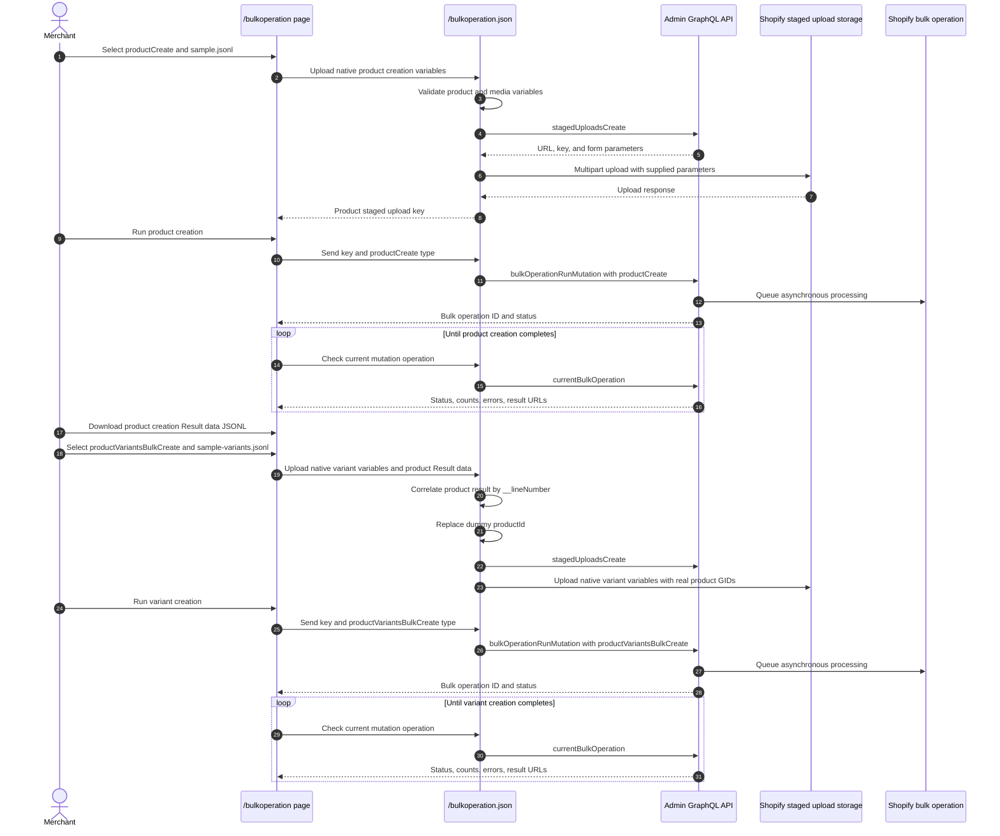

# Bulk Operation

## Purpose

The `/bulkoperation` sample imports products, product images, and different numbers of options and variants per product from JSON Lines files. It demonstrates two dependent Admin GraphQL bulk mutations: [`productCreate`](https://shopify.dev/docs/api/admin-graphql/unstable/mutations/productCreate) creates products with options and media, then [`productVariantsBulkCreate`](https://shopify.dev/docs/api/admin-graphql/unstable/mutations/productVariantsBulkCreate) replaces each initial variant and associates every new variant with existing product media. It also demonstrates status polling, result URLs, partial-data URLs, and cancellation.

Both bundled JSONL files use the native GraphQL variable names and structures accepted by their mutation templates. Because Shopify generates the product GID during the first operation, `sample-variants.jsonl` contains a visible dummy `productId`. Each variant associates media through its native `mediaSrc` field, using the same URL as the corresponding `media[].originalSource` value in `sample.jsonl`.

## Runtime Locations

- The embedded browser submits a JSONL file and the selected operation type to the authenticated app endpoint.
- The app server validates each native variables object. For the bundled variant sample, it correlates Result data by `__lineNumber` and replaces only the dummy `productId` with the Shopify-generated GID.
- The app server uploads the resulting native JSONL to Shopify's staged storage and starts, polls, or cancels the selected bulk operation through Admin GraphQL.
- Shopify processes the staged JSONL asynchronously.

The dummy product-GID replacement is preprocessing implemented by this sample. The media association itself uses Shopify's native `mediaSrc` field: the app doesn't look up media GIDs, assign media by array position, or add sample-specific control fields.

## Import Sequence



## How It Works

The sample downloads use `.jsonl` filenames so that they remain selectable by the uploader's file filter.

### Product creation format

Select **Create products** and upload `sample.jsonl`. Each JSONL line is one native variables object for one [`productCreate`](https://shopify.dev/docs/api/admin-graphql/unstable/mutations/productCreate) invocation, so one line represents one product:

```json
{"product":{"title":"Bulk sample product 3","handle":"bulk-sample-product-3","productOptions":[{"name":"Size","values":[{"name":"Small"},{"name":"Medium"}]},{"name":"Color","values":[{"name":"Red"},{"name":"Blue"}]}]},"media":[{"mediaContentType":"IMAGE","originalSource":"https://cdn.example.com/product-3-1.png"},{"mediaContentType":"IMAGE","originalSource":"https://cdn.example.com/product-3-2.png"},{"mediaContentType":"IMAGE","originalSource":"https://cdn.example.com/product-3-3.png"},{"mediaContentType":"IMAGE","originalSource":"https://cdn.example.com/product-3-4.png"}]}
```

`product` uses [`ProductCreateInput`](https://shopify.dev/docs/api/admin-graphql/unstable/input-objects/ProductCreateInput). Its `handle` is a native optional product field, not an application mapping field. Optional `media` entries use [`CreateMediaInput`](https://shopify.dev/docs/api/admin-graphql/unstable/input-objects/CreateMediaInput), so public image URLs belong in the JSONL file. The product GID can't be preassigned in this operation; Shopify generates it and returns it in Result data.

The bundled sample contains ten products with one, two, or three options and different variant counts. Each product row has one media entry for every planned variant in its same-numbered variant row. For every association, the variant file repeats the exact product-media source URL in `mediaSrc`.

### Variant creation format

After product creation completes, download its **Result data**, select **Create product variants**, and upload both `sample-variants.jsonl` and the downloaded Result data JSONL. Each variant JSONL line is a variables object for one [`productVariantsBulkCreate`](https://shopify.dev/docs/api/admin-graphql/unstable/mutations/productVariantsBulkCreate) invocation:

```json
{"productId":"gid://shopify/Product/0","strategy":"REMOVE_STANDALONE_VARIANT","variants":[{"mediaSrc":["https://cdn.example.com/product-3-1.png"],"optionValues":[{"optionName":"Size","name":"Small"},{"optionName":"Color","name":"Red"}],"price":"30.00","inventoryItem":{"sku":"BULK-003-S-RED"}},{"mediaSrc":["https://cdn.example.com/product-3-2.png"],"optionValues":[{"optionName":"Size","name":"Small"},{"optionName":"Color","name":"Blue"}],"price":"31.00","inventoryItem":{"sku":"BULK-003-S-BLUE"}}]}
```

`productId`, `strategy`, and `variants` are native mutation variables. Every array element uses [`ProductVariantsBulkInput`](https://shopify.dev/docs/api/admin-graphql/unstable/input-objects/ProductVariantsBulkInput), including its optional `mediaSrc` field. `gid://shopify/Product/0` is a deliberately invalid resource placeholder that makes the required product ID visible. It must be replaced before the variables are sent to Shopify.

Each variant specifies its SKU and associated product media URL in the same `variants[]` element. Its `mediaSrc` value must exactly match the corresponding `media[].originalSource` value in the product creation JSONL. The app replaces only the `productId` placeholder from the product creation Result data; it leaves `mediaSrc` unchanged and performs no media ID lookup or positional media mapping.

A custom variant file containing a real `productId` can be staged without a product Result data file. A variant that should have no associated media can omit `mediaSrc`, as allowed by [`ProductVariantsBulkInput`](https://shopify.dev/docs/api/admin-graphql/unstable/input-objects/ProductVariantsBulkInput). Shopify also supports `mediaId` when a real product media GID is already known, but this bundled sample doesn't retrieve or generate media GIDs.

[`REMOVE_STANDALONE_VARIANT`](https://shopify.dev/docs/api/admin-graphql/unstable/enums/ProductVariantsBulkCreateStrategy) removes the single initial variant created by [`productCreate`](https://shopify.dev/docs/api/admin-graphql/unstable/mutations/productCreate) before the new variants are added.

### Product creation Result data

The mutation selection used by this sample returns `product.id`, `product.handle`, and `product.title`. Shopify includes `__lineNumber` in each output object to identify the corresponding zero-based line in the original product creation JSONL:

```json
{"data":{"productCreate":{"product":{"id":"gid://shopify/Product/1000000000003","handle":"bulk-sample-product-3","title":"Bulk sample product 3"},"userErrors":[]}},"__lineNumber":2}
```

The bundled product and variant files deliberately use the same row order. For variant row index `n`, the app reads the successful product result whose `__lineNumber` is `n` and overwrites that row's dummy `productId`. Missing, duplicate, or unsuccessful Result rows are rejected before staged upload.

The media relationship doesn't depend on Result-data order or media array position. Shopify receives each explicit native `mediaSrc` URL, which matches media already added to that product through `media[].originalSource`.

### JSONL row and array mapping

The product creation file is organized as one product per JSONL row:

| JSONL row | Product | Native handle | Contents of single line |
| --- | --- | --- | --- |
| Line 1 | Bulk sample product 1 | `product.handle: bulk-sample-product-1` | `Size: Small, Medium, Large`; media URLs A, B, and C |
| Line 2 | Bulk sample product 2 | `product.handle: bulk-sample-product-2` | `Color: Black, White`; media URLs D and E |
| Line 3 | Bulk sample product 3 | `product.handle: bulk-sample-product-3` | `Size: Small, Medium`; `Color: Red, Blue`; media URLs F, G, H, and I |

The Result data carries generated IDs into the same-numbered variant row:

| Result correlation | Product | Returned product GID |
| --- | --- | --- |
| `__lineNumber: 0` -> variant Line 1 | Bulk sample product 1 | `product.id: gid://shopify/Product/1000000000001` |
| `__lineNumber: 1` -> variant Line 2 | Bulk sample product 2 | `product.id: gid://shopify/Product/1000000000002` |
| `__lineNumber: 2` -> variant Line 3 | Bulk sample product 3 | `product.id: gid://shopify/Product/1000000000003` |

The variant creation file is also one product per JSONL row. Variants are array elements within that row, conceptually arranged like columns:

<table>
  <thead>
    <tr>
      <th rowspan="2">JSONL row</th>
      <th rowspan="2">Product</th>
      <th rowspan="2"><code>productId</code> before upload</th>
      <th rowspan="2"><code>productId</code> after replacement</th>
      <th colspan="4">Contents of single line</th>
    </tr>
    <tr>
      <th><code>variants[0]</code></th>
      <th><code>variants[1]</code></th>
      <th><code>variants[2]</code></th>
      <th><code>variants[...]</code></th>
    </tr>
  </thead>
  <tbody>
    <tr>
      <td>Line 1</td>
      <td>Bulk sample product 1</td>
      <td><code>gid://shopify/Product/0</code></td>
      <td><code>gid://shopify/Product/1000000000001</code></td>
      <td>Size: Small<br><code>mediaSrc: [URL A]</code></td>
      <td>Size: Medium<br><code>mediaSrc: [URL B]</code></td>
      <td>Size: Large<br><code>mediaSrc: [URL C]</code></td>
      <td>-</td>
    </tr>
    <tr>
      <td>Line 2</td>
      <td>Bulk sample product 2</td>
      <td><code>gid://shopify/Product/0</code></td>
      <td><code>gid://shopify/Product/1000000000002</code></td>
      <td>Color: Black<br><code>mediaSrc: [URL D]</code></td>
      <td>Color: White<br><code>mediaSrc: [URL E]</code></td>
      <td>-</td>
      <td>-</td>
    </tr>
    <tr>
      <td>Line 3</td>
      <td>Bulk sample product 3</td>
      <td><code>gid://shopify/Product/0</code></td>
      <td><code>gid://shopify/Product/1000000000003</code></td>
      <td>Size: Small / Color: Red<br><code>mediaSrc: [URL F]</code></td>
      <td>Size: Small / Color: Blue<br><code>mediaSrc: [URL G]</code></td>
      <td>Size: Medium / Color: Red<br><code>mediaSrc: [URL H]</code></td>
      <td>Size: Medium / Color: Blue<br><code>mediaSrc: [URL I]</code></td>
    </tr>
  </tbody>
</table>

URLs A through I represent complete source URLs. The same label in these tables means that `variants[].mediaSrc` contains exactly the URL used by the corresponding product row's `media[].originalSource`; it doesn't mean that the app derives the relationship from array position.

All four variants for Bulk sample product 3 must be inside the one `variants: [...]` array on that product's line. Each variant combines one Size value and one Color value; a Variant is not the list of values belonging to a single Option. Don't write those four variants as four separate JSONL lines. The array can continue with `variants[3]`, `variants[4]`, and so on, and each product row can contain a different number of variants. The sample doesn't impose an application-specific variant-count cap; Shopify's current mutation and product limits still apply.

The two bundled files must keep corresponding products on the same line because Result data is correlated by `__lineNumber`. Product and variant creation cannot use one native Shopify JSONL file or one bulk mutation: [`productVariantsBulkCreate`](https://shopify.dev/docs/api/admin-graphql/unstable/mutations/productVariantsBulkCreate) requires a product GID that doesn't exist until [`productCreate`](https://shopify.dev/docs/api/admin-graphql/unstable/mutations/productCreate) completes.

Starting [`bulkOperationRunMutation`](https://shopify.dev/docs/api/admin-graphql/unstable/mutations/bulkOperationRunMutation) only queues work. The UI must query [`currentBulkOperation(type: MUTATION)`](https://shopify.dev/docs/api/admin-graphql/unstable/queries/currentBulkOperation) until Shopify reports a terminal state. Completed operations can expose a result file; failed or partially successful operations can expose partial data. Cancellation is also asynchronous and should be followed by another status query.

## Production-scale imports

The in-request parsing in this sample is intended for demonstration-sized files. For hundreds of thousands or millions of products, use a durable import pipeline:

- Split input into chunks comfortably below Shopify's 100 MB JSONL limit and the 24-hour bulk-operation execution limit.
- Store each input chunk, operation ID, stage, and retry state in durable storage instead of browser or server memory.
- Stream input and Result data files rather than loading complete files into memory.
- Detect completion with ID-specific status polling or the [`bulk_operations/finish` webhook](https://shopify.dev/docs/api/admin-graphql/unstable/enums/WebhookSubscriptionTopic#enums-BULK_OPERATIONS_FINISH), then download and retain the temporary Result data before its URL expires.
- Build each variant chunk from the corresponding product creation Result data, using `__lineNumber` or another durable source mapping to correlate product IDs. Preserve the explicit SKU-to-source-URL relationship from the input data when generating each native `mediaSrc` value.
- Retry only failed result lines and make retries idempotent so a restarted worker doesn't create duplicate products or variants.
- Schedule within the API-version concurrency limit. API version 2026-01 and later allows up to five concurrent bulk mutation operations per app and shop.

## Common Pitfalls

- Upload success and bulk-operation success are separate events.
- JSONL requires one valid JSON object per line, not a JSON array and not a multiline object.
- Match the selected operation type to the uploaded file format.
- Complete the product operation and download its Result data before uploading the bundled variant sample; the dummy product GID isn't a Shopify resource and can't be sent unchanged.
- Use Result data whose `data` object contains [`productCreate`](https://shopify.dev/docs/api/admin-graphql/unstable/mutations/productCreate). Result data containing [`productVariantsBulkCreate`](https://shopify.dev/docs/api/admin-graphql/unstable/mutations/productVariantsBulkCreate) comes from the second operation and can't provide the required product GID.
- Keep the bundled product and variant rows aligned. `__lineNumber: 0` supplies IDs for variant row 1, `__lineNumber: 1` supplies row 2, and so on.
- Shopify doesn't automatically assign a product's media to variants by array position. In this sample, every staged variant explicitly identifies existing product media by using the same source URL in `variants[].mediaSrc` and `media[].originalSource`.
- Every variant must provide one value for every option defined on its product.
- Product image URLs must be reachable by Shopify over HTTP or HTTPS; local filesystem and `localhost` URLs can't be imported.
- The bundled product handles are fixed. Delete previously imported sample products before rerunning the product sample, or change the handles.
- Bulk operations return top-level user errors immediately and per-record errors in output data; inspect both.
- Poll with backoff instead of a tight loop.
- Staged targets and result URLs are temporary.
- Shopify limits concurrent bulk operations by type and API rules; check current limits before production scheduling.

## Key Terms

| Term | Meaning |
| --- | --- |
| JSONL | JSON Lines format containing one independent JSON value per line |
| Staged upload | Temporary Shopify-managed storage used as bulk mutation input |
| Mutation template | GraphQL mutation applied once for each JSONL variables object |
| Option | A product dimension such as Size, Color, or Material. A product can have up to three options |
| Variant | A purchasable configuration selecting one value from every option, with its own GID, SKU, price, and inventory. Stores support up to 2,048 variants per product by default |
| [`productCreate`](https://shopify.dev/docs/api/admin-graphql/unstable/mutations/productCreate) | First-stage mutation creating each product, its options, initial variant, and media |
| [`productVariantsBulkCreate`](https://shopify.dev/docs/api/admin-graphql/unstable/mutations/productVariantsBulkCreate) | Second-stage mutation creating multiple variants for an existing product |
| `productId` | Native required mutation variable identifying the product that receives variants |
| `mediaSrc` | Native optional [`ProductVariantsBulkInput`](https://shopify.dev/docs/api/admin-graphql/unstable/input-objects/ProductVariantsBulkInput) field associating existing product media with a variant by source URL |
| `__lineNumber` | Zero-based input line number included in each bulk mutation Result data record for correlation and error handling |
| Dummy GID | Visible sample `productId` ending in `/0`; the app replaces it with a real Shopify-generated product GID before staging |
| Bulk operation | Asynchronous Shopify job processing a large set of API records |
| Partial data URL | Output generated before or alongside a failed or incomplete operation |

## Source Map

- [`app/pages/BulkOperation.jsx`](../app/pages/BulkOperation.jsx): file upload, start, poll, and cancel UI
- [`app/routes/bulkoperation-json.jsx`](../app/routes/bulkoperation-json.jsx): authenticated route
- [`app/lib/bulk-operation.server.js`](../app/lib/bulk-operation.server.js): product ID placeholder replacement, staged upload, and bulk GraphQL operations
- [`app/assets/sample.jsonl`](../app/assets/sample.jsonl): native product creation variables with one media URL per planned sample variant
- [`app/assets/sample-variants.jsonl`](../app/assets/sample-variants.jsonl): native variant creation variables with a visible product GID placeholder and explicit `mediaSrc` URLs

## Official Shopify References

- [Import data with bulk operations](https://shopify.dev/docs/api/usage/bulk-operations/imports)
- [Bulk operation overview](https://shopify.dev/docs/api/usage/bulk-operations)
- [Run a bulk mutation](https://shopify.dev/docs/api/admin-graphql/unstable/mutations/bulkOperationRunMutation)
- [Create a product with `productCreate`](https://shopify.dev/docs/api/admin-graphql/unstable/mutations/productCreate)
- [`ProductCreateInput`](https://shopify.dev/docs/api/admin-graphql/unstable/input-objects/ProductCreateInput)
- [`CreateMediaInput`](https://shopify.dev/docs/api/admin-graphql/unstable/input-objects/CreateMediaInput)
- [`ProductOption` reference](https://shopify.dev/docs/api/admin-graphql/unstable/objects/ProductOption)
- [`ProductVariant` reference](https://shopify.dev/docs/api/admin-graphql/unstable/objects/ProductVariant)
- [Create product variants with `productVariantsBulkCreate`](https://shopify.dev/docs/api/admin-graphql/unstable/mutations/productVariantsBulkCreate)
- [`ProductVariantsBulkInput`](https://shopify.dev/docs/api/admin-graphql/unstable/input-objects/ProductVariantsBulkInput)
- [Manage media for products and variants](https://shopify.dev/docs/apps/build/product-merchandising/products-and-collections/manage-media)
