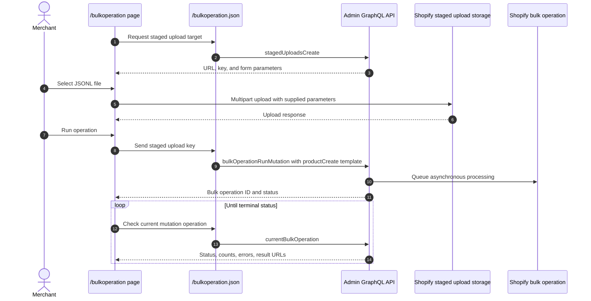

# Bulk Operation

## Purpose

The `/bulkoperation` sample imports products from a JSON Lines file by combining a staged upload with an asynchronous Admin GraphQL bulk mutation. It also demonstrates status polling, result URLs, partial-data URLs, and cancellation.

## Runtime Locations

- The embedded browser requests staged-upload parameters and submits the file directly to Shopify's storage target.
- The app server creates the staged target and starts, polls, or cancels the bulk operation through Admin GraphQL.
- Shopify processes the JSONL file asynchronously.

## Import Sequence

## How It Works

`stagedUploadsCreate` returns a storage URL plus mandatory form fields. The browser posts the JSONL file directly to that URL. Each line in the file is the variables object for the operation's `productCreate` mutation template.

Starting `bulkOperationRunMutation` only queues work. The UI must query `currentBulkOperation(type: MUTATION)` until Shopify reports a terminal state. Completed operations can expose a result file; failed or partially successful operations can expose partial data. Cancellation is also asynchronous and should be followed by another status query.

## Common Pitfalls

- Upload success and bulk-operation success are separate events.
- JSONL requires one valid JSON object per line, not a JSON array and not a multiline object.
- The staged upload key from the returned parameters is the path passed to the bulk mutation.
- Bulk operations return top-level user errors immediately and per-record errors in output data; inspect both.
- Poll with backoff instead of a tight loop.
- Staged targets and result URLs are temporary.
- Shopify limits concurrent bulk operations by type and API rules; check current limits before production scheduling.

## Key Terms

| Term | Meaning |
| --- | --- |
| JSONL | JSON Lines format containing one independent JSON value per line |
| Staged upload | Temporary Shopify-managed storage used as bulk mutation input |
| Mutation template | GraphQL mutation applied once for each JSONL variables object |
| Bulk operation | Asynchronous Shopify job processing a large set of API records |
| Partial data URL | Output generated before or alongside a failed or incomplete operation |

## Source Map

- [`app/pages/BulkOperation.jsx`](../app/pages/BulkOperation.jsx): file upload, start, poll, and cancel UI
- [`app/routes/bulkoperation-json.jsx`](../app/routes/bulkoperation-json.jsx): authenticated route
- [`app/lib/order-and-bulk.server.js`](../app/lib/order-and-bulk.server.js): staged upload and bulk GraphQL operations
- [`app/assets/sample.jsonl`](../app/assets/sample.jsonl): example input

## Official Shopify References

- [Import data with bulk operations](https://shopify.dev/docs/api/usage/bulk-operations/imports)
- [Bulk operation overview](https://shopify.dev/docs/api/usage/bulk-operations)
- [Run a bulk mutation](https://shopify.dev/docs/api/admin-graphql/latest/mutations/bulkOperationRunMutation)
- [Create staged upload targets](https://shopify.dev/docs/api/admin-graphql/latest/mutations/stagedUploadsCreate)
- [Query current bulk operation](https://shopify.dev/docs/api/admin-graphql/latest/queries/currentBulkOperation)
