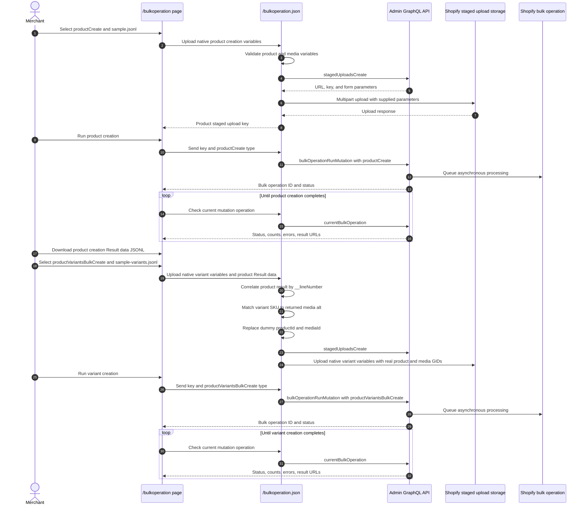

# Bulk Operation

## Purpose

The `/bulkoperation` sample imports products, product images, and different numbers of options and variants per product from JSON Lines files. It demonstrates two dependent Admin GraphQL bulk mutations: [`productCreate`](https://shopify.dev/docs/api/admin-graphql/unstable/mutations/productCreate) creates products with options and media, then [`productVariantsBulkCreate`](https://shopify.dev/docs/api/admin-graphql/unstable/mutations/productVariantsBulkCreate) replaces each initial variant and associates every new variant with existing product media. It also demonstrates status polling, result URLs, partial-data URLs, and cancellation.

Both bundled JSONL files use the native GraphQL variable names and structures accepted by their mutation templates. Because Shopify generates product and media GIDs during the first operation, `sample-variants.jsonl` contains visible dummy `productId` and `mediaId` values. In `sample.jsonl`, each media item's native `alt` field contains the SKU of its planned variant. The app uses that explicit SKU-to-alt relationship to replace both dummy GIDs with IDs from the product creation Result data before staging the variant file.

## Runtime Locations

- The embedded browser submits a JSONL file and the selected operation type to the authenticated app endpoint.
- The app server validates each native variables object. For the bundled variant sample, it correlates Result data by `__lineNumber`, matches each variant SKU to product media `alt`, and replaces the dummy `productId` and `mediaId` values with Shopify-generated GIDs.
- The app server uploads the resulting native JSONL to Shopify's staged storage and starts, polls, or cancels the selected bulk operation through Admin GraphQL.
- Shopify processes the staged JSONL asynchronously.

The dummy-GID replacement and SKU-to-alt matching are preprocessing implemented by this sample. The staged variables use Shopify's native `productId` and `mediaId` fields. Shopify doesn't automatically match a SKU to media alt text, and this sample never assigns media by array position.

## Import Sequence



## How It Works

The sample downloads use `.jsonl` filenames so that they remain selectable by the uploader's file filter.

### Product creation format

Select **Create products** and upload `sample.jsonl`. Each JSONL line is one native variables object for one [`productCreate`](https://shopify.dev/docs/api/admin-graphql/unstable/mutations/productCreate) invocation, so one line represents one product:

```json
{"product":{"title":"Bulk sample product 3","productOptions":[{"name":"Size","values":[{"name":"Small"},{"name":"Medium"}]},{"name":"Color","values":[{"name":"Red"},{"name":"Blue"}]}]},"media":[{"alt":"BULK-003-S-RED","mediaContentType":"IMAGE","originalSource":"https://cdn.example.com/product-3-1.png"},{"alt":"BULK-003-S-BLUE","mediaContentType":"IMAGE","originalSource":"https://cdn.example.com/product-3-2.png"},{"alt":"BULK-003-M-RED","mediaContentType":"IMAGE","originalSource":"https://cdn.example.com/product-3-3.png"},{"alt":"BULK-003-M-BLUE","mediaContentType":"IMAGE","originalSource":"https://cdn.example.com/product-3-4.png"}]}
```

`product` uses [`ProductCreateInput`](https://shopify.dev/docs/api/admin-graphql/unstable/input-objects/ProductCreateInput). Optional `media` entries use [`CreateMediaInput`](https://shopify.dev/docs/api/admin-graphql/unstable/input-objects/CreateMediaInput), so public image URLs belong in the JSONL file. The bundled sample omits the optional product `handle`; Shopify constructs it from the title, adding a suffix when needed for uniqueness. The handle isn't used for Result-data correlation. The sample stores the planned variant SKU in each media item's native `alt` field. Product and media GIDs can't be preassigned in this operation; Shopify generates them and returns them in Result data.

The bundled sample contains ten products with one, two, or three options and different variant counts. Each product row has one media entry for every planned variant in its same-numbered variant row. Every media `alt` is unique within its product and exactly matches one `variants[].inventoryItem.sku` value in the variant file.

> **Product media exposure:** After Shopify registers a file as product media, it is served from a CDN URL that anyone who obtains the URL can access, regardless of whether the store or product is published, draft, or assigned to a sales channel. Product visibility controls discovery through Shopify surfaces, but they don't make the CDN URL private. Don't upload files that must remain confidential. To align image availability more closely with a product launch, create the product without media and add the images later through [`productUpdate`](https://shopify.dev/docs/api/admin-graphql/unstable/mutations/productUpdate), shortly before publishing the product. The final segment of a Shopify CDN URL is based on the uploaded filename, so use non-descriptive, difficult-to-guess filenames instead of product names, SKUs, launch dates, or other predictable values. A difficult-to-guess filename reduces accidental discovery but isn't an access-control mechanism.

### Variant creation format

After product creation completes, download its **Result data**, select **Create product variants**, and upload both `sample-variants.jsonl` and the downloaded Result data JSONL. Each variant JSONL line is a variables object for one [`productVariantsBulkCreate`](https://shopify.dev/docs/api/admin-graphql/unstable/mutations/productVariantsBulkCreate) invocation:

```json
{"productId":"gid://shopify/Product/0","strategy":"REMOVE_STANDALONE_VARIANT","variants":[{"mediaId":"gid://shopify/MediaImage/0","optionValues":[{"optionName":"Size","name":"Small"},{"optionName":"Color","name":"Red"}],"price":"30.00","inventoryItem":{"sku":"BULK-003-S-RED"}},{"mediaId":"gid://shopify/MediaImage/0","optionValues":[{"optionName":"Size","name":"Small"},{"optionName":"Color","name":"Blue"}],"price":"31.00","inventoryItem":{"sku":"BULK-003-S-BLUE"}}]}
```

`productId`, `strategy`, and `variants` are native mutation variables. Every array element uses [`ProductVariantsBulkInput`](https://shopify.dev/docs/api/admin-graphql/unstable/input-objects/ProductVariantsBulkInput), including its optional `mediaId` field. `gid://shopify/Product/0` and `gid://shopify/MediaImage/0` are deliberately invalid resource placeholders that make both required generated IDs visible. They must be replaced before the variables are sent to Shopify.

Each variant specifies its SKU and dummy `mediaId` in the same `variants[]` element. The app finds media in that product's Result data whose `alt` exactly matches the SKU, then replaces the dummy `mediaId` with the returned media GID. This lookup is independent of media array and Result-data order.

A custom variant file containing real `productId` and `mediaId` values can be staged without a product Result data file. A variant that should have no associated media can omit `mediaId`, as allowed by [`ProductVariantsBulkInput`](https://shopify.dev/docs/api/admin-graphql/unstable/input-objects/ProductVariantsBulkInput). Shopify requires the referenced media to already belong to that product.

[`REMOVE_STANDALONE_VARIANT`](https://shopify.dev/docs/api/admin-graphql/unstable/enums/ProductVariantsBulkCreateStrategy) removes the single initial variant created by [`productCreate`](https://shopify.dev/docs/api/admin-graphql/unstable/mutations/productCreate) before the new variants are added.

### Product creation Result data

The mutation selection used by this sample returns `product.id`, `product.title`, and `product.media.nodes { id alt }`. Shopify includes `__lineNumber` in each output object to identify the corresponding zero-based line in the original product creation JSONL:

```json
{"data":{"productCreate":{"product":{"id":"gid://shopify/Product/1000000000003","title":"Bulk sample product 3","media":{"nodes":[{"id":"gid://shopify/MediaImage/2000000000001","alt":"BULK-003-S-RED"},{"id":"gid://shopify/MediaImage/2000000000002","alt":"BULK-003-S-BLUE"}]}},"userErrors":[]}},"__lineNumber":2}
```

The bundled product and variant files deliberately use the same row order. For variant row index `n`, the app reads the successful product result whose `__lineNumber` is `n` and overwrites that row's dummy `productId`. Within the matched product, it builds an `alt`-to-media-GID map and replaces each dummy `mediaId` using the variant SKU. Missing, duplicate, or unsuccessful Result rows, duplicate media alt values, and missing SKU-to-alt matches are rejected before staged upload.

The media relationship doesn't depend on Result-data order or media array position. Shopify receives each explicit native `mediaId` after the sample's preprocessing has resolved that GID through the SKU-to-alt map.

### JSONL row and array mapping

The product creation file is organized as one product per JSONL row. Each row contains the product's options and its media source URLs, with the planned variant SKU stored as each media item's alt value:

| JSONL row | Product | Contents of single line (options and media URLs with alt) |
| --- | --- | --- |
| Line 1 | Bulk sample product 1 | `Size: Small, Medium, Large`; URL A (`alt: BULK-001-S`), URL B (`alt: BULK-001-M`), and URL C (`alt: BULK-001-L`) |
| Line 2 | Bulk sample product 2 | `Color: Black, White`; URL D (`alt: BULK-002-BLACK`) and URL E (`alt: BULK-002-WHITE`) |
| Line 3 | Bulk sample product 3 | `Size: Small, Medium`; `Color: Red, Blue`; four media URLs whose alt values match its four variant SKUs |

URL A through URL E represent the complete public URLs in each `media[].originalSource` field.

The Result data returns the generated Product Id and each media Id with its alt value. The app carries the returned Product Id and media Ids into the same-numbered variant row:

| Result correlation | Product | Returned product Id | Returned media Id and alt |
| --- | --- | --- | --- |
| `__lineNumber: 0` -> variant Line 1 | Bulk sample product 1 | `product.id: gid://shopify/Product/1000000000001` | `id: gid://shopify/MediaImage/2000000000001`; `alt: BULK-001-S` |
| `__lineNumber: 1` -> variant Line 2 | Bulk sample product 2 | `product.id: gid://shopify/Product/1000000000002` | `id: gid://shopify/MediaImage/2000000000004`; `alt: BULK-002-BLACK` |
| `__lineNumber: 2` -> variant Line 3 | Bulk sample product 3 | `product.id: gid://shopify/Product/1000000000003` | `id: gid://shopify/MediaImage/2000000000006`; `alt: BULK-003-S-RED` |

The variant creation file is also one product per JSONL row. After preprocessing, each row contains the resolved Product Id and a variants array. Its variants are conceptually arranged like columns and contain option values, SKUs, and resolved media Ids:

<table>
  <thead>
    <tr>
      <th rowspan="2">JSONL row</th>
      <th rowspan="2">Product</th>
      <th rowspan="2">Product Id</th>
      <th colspan="4">Contents of single line (variants made of options, SKUs, and media Ids)</th>
    </tr>
    <tr>
      <th><code>variants[0]</code></th>
      <th><code>variants[1]</code></th>
      <th><code>variants[2]</code></th>
      <th><code>variants[...]</code></th>
    </tr>
  </thead>
  <tbody>
    <tr>
      <td>Line 1</td>
      <td>Bulk sample product 1</td>
      <td><code>gid://shopify/Product/1000000000001</code></td>
      <td>Size: Small<br><code>SKU: BULK-001-S</code><br><code>mediaId: ...0001</code></td>
      <td>Size: Medium<br><code>SKU: BULK-001-M</code><br><code>mediaId: ...0002</code></td>
      <td>Size: Large<br><code>SKU: BULK-001-L</code><br><code>mediaId: ...0003</code></td>
      <td>-</td>
    </tr>
    <tr>
      <td>Line 2</td>
      <td>Bulk sample product 2</td>
      <td><code>gid://shopify/Product/1000000000002</code></td>
      <td>Color: Black<br><code>SKU: BULK-002-BLACK</code><br><code>mediaId: ...0004</code></td>
      <td>Color: White<br><code>SKU: BULK-002-WHITE</code><br><code>mediaId: ...0005</code></td>
      <td>-</td>
      <td>-</td>
    </tr>
    <tr>
      <td>Line 3</td>
      <td>Bulk sample product 3</td>
      <td><code>gid://shopify/Product/1000000000003</code></td>
      <td>Size: Small / Color: Red<br><code>SKU: BULK-003-S-RED</code><br><code>mediaId: ...0006</code></td>
      <td>Size: Small / Color: Blue<br><code>SKU: BULK-003-S-BLUE</code><br><code>mediaId: ...0007</code></td>
      <td>Size: Medium / Color: Red<br><code>SKU: BULK-003-M-RED</code><br><code>mediaId: ...0008</code></td>
      <td>Size: Medium / Color: Blue<br><code>SKU: BULK-003-M-BLUE</code><br><code>mediaId: ...0009</code></td>
    </tr>
  </tbody>
</table>

Before preprocessing, each bundled row contains `productId: gid://shopify/Product/0`, and every bundled variant contains `mediaId: gid://shopify/MediaImage/0`. The table shows the resolved Product Id and media Ids. The media Ids abbreviated as `...0001` through `...0009` are inserted before staged upload by matching each variant SKU to returned media alt text, not by using the variant or media array position.

All four variants for Bulk sample product 3 must be inside the one `variants: [...]` array on that product's line. Each variant combines one Size value and one Color value; a Variant is not the list of values belonging to a single Option. Don't write those four variants as four separate JSONL lines. The array can continue with `variants[3]`, `variants[4]`, and so on, and each product row can contain a different number of variants. The sample doesn't impose an application-specific variant-count cap; Shopify's current mutation and product limits still apply.

The two bundled files must keep corresponding products on the same line because Result data is correlated by `__lineNumber`. Product and variant creation cannot use one native Shopify JSONL file or one bulk mutation: [`productVariantsBulkCreate`](https://shopify.dev/docs/api/admin-graphql/unstable/mutations/productVariantsBulkCreate) requires a Product Id that doesn't exist until [`productCreate`](https://shopify.dev/docs/api/admin-graphql/unstable/mutations/productCreate) completes.

Starting [`bulkOperationRunMutation`](https://shopify.dev/docs/api/admin-graphql/unstable/mutations/bulkOperationRunMutation) only queues work. The UI must query [`currentBulkOperation(type: MUTATION)`](https://shopify.dev/docs/api/admin-graphql/unstable/queries/currentBulkOperation) until Shopify reports a terminal state. Completed operations can expose a result file; failed or partially successful operations can expose partial data. Cancellation is also asynchronous and should be followed by another status query.

## Production-scale imports

The in-request parsing in this sample is intended for demonstration-sized files. For hundreds of thousands or millions of products, use a durable import pipeline:

- Split input into chunks comfortably below Shopify's 100 MB JSONL limit and the 24-hour bulk-operation execution limit.
- Store each input chunk, operation ID, stage, and retry state in durable storage instead of browser or server memory.
- Stream input and Result data files rather than loading complete files into memory.
- Detect completion with ID-specific status polling or the [`bulk_operations/finish` webhook](https://shopify.dev/docs/api/admin-graphql/unstable/enums/WebhookSubscriptionTopic#enums-BULK_OPERATIONS_FINISH), then download and retain the temporary Result data before its URL expires.
- Build each variant chunk from the corresponding product creation Result data, using `__lineNumber` or another durable source mapping to correlate product IDs. Resolve native `mediaId` values through an explicit, unique media key rather than relying on connection order; this sample uses matching SKU and media alt values.
- Treat the use of media alt text as a correlation key as a documented sample tradeoff. If descriptive alt text is required for accessibility and storefront content, restore it after association or retain the SKU-to-media mapping in durable import data instead.
- Retry only failed result lines and make retries idempotent so a restarted worker doesn't create duplicate products or variants.
- Schedule within the API-version concurrency limit. API version 2026-01 and later allows up to five concurrent bulk mutation operations per app and shop.

## Common Pitfalls

- Upload success and bulk-operation success are separate events.
- JSONL requires one valid JSON object per line, not a JSON array and not a multiline object.
- Match the selected operation type to the uploaded file format.
- Complete the product operation and download its Result data before uploading the bundled variant sample; neither dummy GID is a Shopify resource and neither can be sent unchanged.
- Use Result data whose `data` object contains [`productCreate`](https://shopify.dev/docs/api/admin-graphql/unstable/mutations/productCreate). Result data containing [`productVariantsBulkCreate`](https://shopify.dev/docs/api/admin-graphql/unstable/mutations/productVariantsBulkCreate) comes from the second operation and can't provide the required product GID.
- Keep the bundled product and variant rows aligned. `__lineNumber: 0` supplies IDs for variant row 1, `__lineNumber: 1` supplies row 2, and so on.
- Shopify doesn't automatically match media to variants by SKU, alt text, or array position. This sample performs SKU-to-alt matching before upload and sends Shopify the resulting native `mediaId` explicitly.
- Keep each media alt value unique within its product and equal to the intended variant SKU. Duplicate alt values or missing matches are rejected by this sample.
- Every variant must provide one value for every option defined on its product.
- Product image URLs must be reachable by Shopify over HTTP or HTTPS; local filesystem and `localhost` URLs can't be imported.
- Bulk operations return top-level user errors immediately and per-record errors in output data; inspect both.
- Poll with backoff instead of a tight loop.
- Shopify limits concurrent bulk operations by type and API rules; check current limits before production scheduling.

## Key Terms

| Term | Meaning |
| --- | --- |
| JSONL | JSON Lines format containing one independent JSON value per line |
| Staged upload | Temporary Shopify-managed storage used as bulk mutation input |
| Mutation template | GraphQL mutation applied once for each JSONL variables object |
| Option | A product dimension such as Size, Color, or Material. A product can have up to three options |
| Variant | A purchasable configuration selecting one value from every option, with its own GID, SKU, price, and inventory. Stores support up to 2,048 variants per product by default |
| [`productCreate`](https://shopify.dev/docs/api/admin-graphql/unstable/mutations/productCreate) | First-stage mutation creating each product, its options, initial variant, and media |
| [`productVariantsBulkCreate`](https://shopify.dev/docs/api/admin-graphql/unstable/mutations/productVariantsBulkCreate) | Second-stage mutation creating multiple variants for an existing product |
| `productId` | Native required mutation variable identifying the product that receives variants |
| `mediaId` | Native optional [`ProductVariantsBulkInput`](https://shopify.dev/docs/api/admin-graphql/unstable/input-objects/ProductVariantsBulkInput) field associating media that already belongs to the product with a variant |
| Media alt mapping | Sample preprocessing convention in which `CreateMediaInput.alt` equals the planned variant SKU; Shopify itself doesn't interpret that relationship |
| `__lineNumber` | Zero-based input line number included in each bulk mutation Result data record for correlation and error handling |
| Dummy GID | Visible sample `productId` or `mediaId` ending in `/0`; the app replaces it with a real Shopify-generated GID before staging |
| Bulk operation | Asynchronous Shopify job processing a large set of API records |
| Partial data URL | Output generated before or alongside a failed or incomplete operation |

## Source Map

- [`app/pages/BulkOperation.jsx`](../app/pages/BulkOperation.jsx): file upload, start, poll, and cancel UI
- [`app/routes/bulkoperation-json.jsx`](../app/routes/bulkoperation-json.jsx): authenticated route
- [`app/lib/bulk-operation.server.js`](../app/lib/bulk-operation.server.js): product and media ID placeholder replacement, staged upload, and bulk GraphQL operations
- [`app/assets/sample.jsonl`](../app/assets/sample.jsonl): native product creation variables with one SKU-tagged media item per planned sample variant
- [`app/assets/sample-variants.jsonl`](../app/assets/sample-variants.jsonl): native variant creation variables with visible product and media GID placeholders

## Official Shopify References

- [Import data with bulk operations](https://shopify.dev/docs/api/usage/bulk-operations/imports)
- [Bulk operation overview](https://shopify.dev/docs/api/usage/bulk-operations)
- [Run a bulk mutation](https://shopify.dev/docs/api/admin-graphql/unstable/mutations/bulkOperationRunMutation)
- [Create a product with `productCreate`](https://shopify.dev/docs/api/admin-graphql/unstable/mutations/productCreate)
- [`ProductCreateInput`](https://shopify.dev/docs/api/admin-graphql/unstable/input-objects/ProductCreateInput)
- [`CreateMediaInput`](https://shopify.dev/docs/api/admin-graphql/unstable/input-objects/CreateMediaInput)
- [`ProductOption` reference](https://shopify.dev/docs/api/admin-graphql/unstable/objects/ProductOption)
- [`ProductVariant` reference](https://shopify.dev/docs/api/admin-graphql/unstable/objects/ProductVariant)
- [Create product variants with `productVariantsBulkCreate`](https://shopify.dev/docs/api/admin-graphql/unstable/mutations/productVariantsBulkCreate)
- [`ProductVariantsBulkInput`](https://shopify.dev/docs/api/admin-graphql/unstable/input-objects/ProductVariantsBulkInput)
- [Manage media for products and variants](https://shopify.dev/docs/apps/build/product-merchandising/products-and-collections/manage-media)
