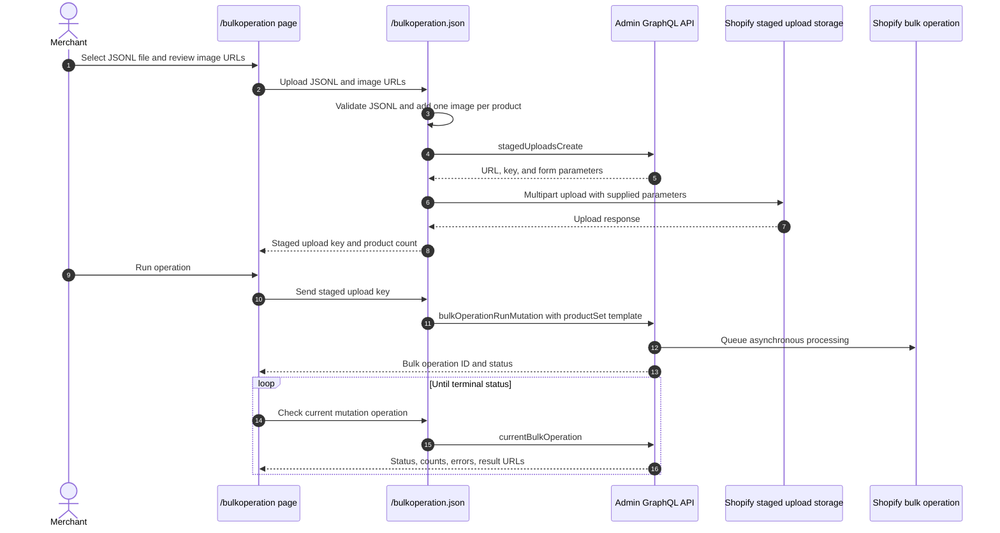

# Bulk Operation

## Purpose

The `/bulkoperation` sample imports products, product images, and up to three variants per product from a JSON Lines file by combining a staged upload with an asynchronous Admin GraphQL bulk mutation. It also demonstrates status polling, result URLs, partial-data URLs, and cancellation.

## Runtime Locations

- The embedded browser submits the JSONL file and comma-separated public image URLs to the authenticated app endpoint.
- The app server validates the JSONL, assigns the image URLs in product order, uploads the enriched file to Shopify's staged storage, and starts, polls, or cancels the bulk operation through Admin GraphQL.
- Shopify processes the JSONL file asynchronously.

## Import Sequence

## How It Works

The sample download is generated as `sample.jsonl`, so it remains selectable by the uploader's `.jsonl` filter. Each line is the variables object for the operation's `productSet` mutation template and defines one product with its options and up to three variants.

The upload form also contains comma-separated, publicly accessible image URLs. The server assigns one URL to each JSONL line in order and starts again from the first URL when there are more products than URLs. It writes the assigned URL to `ProductSetInput.files`, calls `stagedUploadsCreate`, and posts the enriched JSONL file to the returned storage target.

Starting `bulkOperationRunMutation` only queues work. The UI must query `currentBulkOperation(type: MUTATION)` until Shopify reports a terminal state. Completed operations can expose a result file; failed or partially successful operations can expose partial data. Cancellation is also asynchronous and should be followed by another status query.

## Common Pitfalls

- Upload success and bulk-operation success are separate events.
- JSONL requires one valid JSON object per line, not a JSON array and not a multiline object.
- Each line must contain a `ProductSetInput` object with between one and three variants.
- Product image URLs must be reachable by Shopify over HTTP or HTTPS; local filesystem and `localhost` URLs cannot be imported.
- The image URL list is reused cyclically. In the bundled ten-product sample, each of the five default images is therefore used twice.
- The staged upload key from the returned parameters is the path passed to the bulk mutation.
- Bulk operations return top-level user errors immediately and per-record errors in output data; inspect both.
- Poll with backoff instead of a tight loop.
- Staged targets and result URLs are temporary.
- Shopify limits concurrent bulk operations by type and API rules; check current limits before production scheduling.

## Key Terms

| Term | Meaning |
| --- | --- |
| JSONL | JSON Lines format containing one independent JSON value per line |
| Staged upload | Temporary Shopify-managed storage used as bulk mutation input |
| Mutation template | GraphQL mutation applied once for each JSONL variables object |
| `productSet` | Mutation used here to create a product, options, variants, and media in one operation |
| Bulk operation | Asynchronous Shopify job processing a large set of API records |
| Partial data URL | Output generated before or alongside a failed or incomplete operation |

## Source Map

- [`app/pages/BulkOperation.jsx`](../app/pages/BulkOperation.jsx): file upload, start, poll, and cancel UI
- [`app/routes/bulkoperation-json.jsx`](../app/routes/bulkoperation-json.jsx): authenticated route
- [`app/lib/bulk-operation.server.js`](../app/lib/bulk-operation.server.js): staged upload and bulk GraphQL operations
- [`app/assets/sample.jsonl`](../app/assets/sample.jsonl): example input

## Official Shopify References

- [Import data with bulk operations](https://shopify.dev/docs/api/usage/bulk-operations/imports)
- [Bulk operation overview](https://shopify.dev/docs/api/usage/bulk-operations)
- [Run a bulk mutation](https://shopify.dev/docs/api/admin-graphql/latest/mutations/bulkOperationRunMutation)
- [Create or update a product with `productSet`](https://shopify.dev/docs/api/admin-graphql/latest/mutations/productSet)
- [Create staged upload targets](https://shopify.dev/docs/api/admin-graphql/latest/mutations/stagedUploadsCreate)
- [Query current bulk operation](https://shopify.dev/docs/api/admin-graphql/latest/queries/currentBulkOperation)
