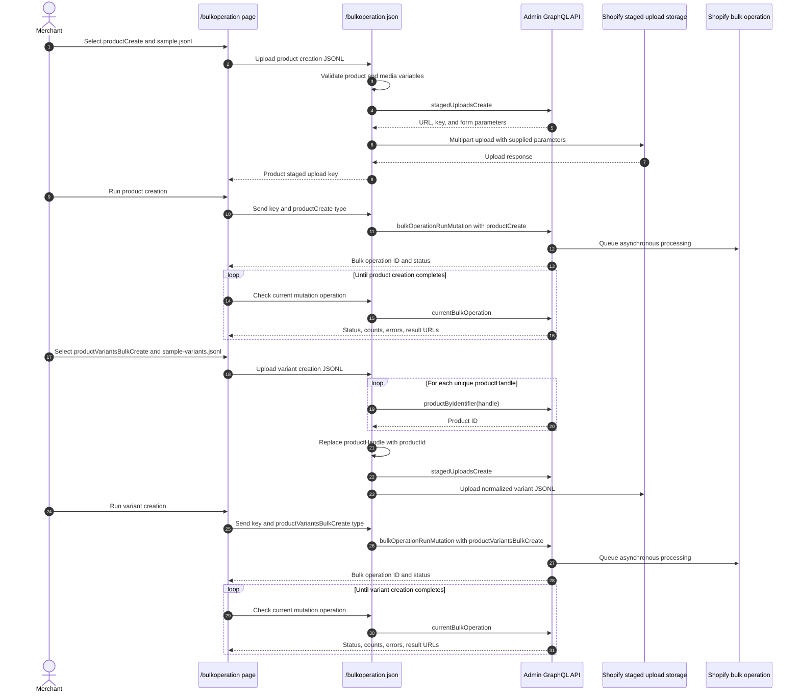

# Bulk Operation

## Purpose

The `/bulkoperation` sample imports products, product images, and up to three variants per product from JSON Lines files. It demonstrates two dependent Admin GraphQL bulk mutations: `productCreate` creates products with options and media, then `productVariantsBulkCreate` replaces each initial variant with the variants from a second file. It also demonstrates status polling, result URLs, partial-data URLs, and cancellation.

## Runtime Locations

- The embedded browser submits a JSONL file and the selected operation type to the authenticated app endpoint.
- The app server validates product creation records. For variant records, it also resolves `productHandle` values to Shopify product IDs before creating the staged file.
- The app server uploads the prepared file to Shopify's staged storage and starts, polls, or cancels the selected bulk operation through Admin GraphQL.
- Shopify processes the JSONL file asynchronously.

## Import Sequence



## How It Works

The sample downloads are generated with `.jsonl` filenames so that they remain selectable by the uploader's file filter.

### Product creation format

Select **Create products** and upload `sample.jsonl`. Each line is the variables object for `productCreate`:

```json
{"product":{"title":"Example","handle":"example","productOptions":[{"name":"Size","values":[{"name":"Small"},{"name":"Medium"},{"name":"Large"}]}]},"media":[{"mediaContentType":"IMAGE","originalSource":"https://cdn.example.com/image.png"}]}
```

`product` uses `ProductCreateInput`. Optional `media` entries use `CreateMediaInput`, so public image URLs belong in the JSONL file rather than in a separate UI field. The bundled sample contains ten products and reuses five image URLs twice.

### Variant creation format

After product creation completes, select **Create product variants** and upload `sample-variants.jsonl`. Each line contains one to three `ProductVariantsBulkInput` records and identifies the product by `productId` or `productHandle`:

```json
{"productHandle":"example","strategy":"REMOVE_STANDALONE_VARIANT","variants":[{"optionValues":[{"optionName":"Size","name":"Small"}],"price":"10.00","inventoryItem":{"sku":"EXAMPLE-S"}}]}
```

`productId` is the native `productVariantsBulkCreate` variable. `productHandle` is a sample convenience field: the app server resolves it with `productByIdentifier` and writes the resulting `productId` to the staged JSONL. `REMOVE_STANDALONE_VARIANT` removes the single initial variant created by `productCreate` before the new variants are added.

Product and variant creation cannot use one native Shopify JSONL file or one bulk mutation. `productVariantsBulkCreate` requires a product ID that does not exist until `productCreate` has completed, so the two operations must run sequentially.

Starting `bulkOperationRunMutation` only queues work. The UI must query `currentBulkOperation(type: MUTATION)` until Shopify reports a terminal state. Completed operations can expose a result file; failed or partially successful operations can expose partial data. Cancellation is also asynchronous and should be followed by another status query.

## Common Pitfalls

- Upload success and bulk-operation success are separate events.
- JSONL requires one valid JSON object per line, not a JSON array and not a multiline object.
- Match the selected operation type to the uploaded file format.
- Complete the product operation before uploading a handle-based variant file; unresolved handles are rejected before staging.
- Variant records can use a native `productId` instead of the sample-specific `productHandle` field.
- The sample limits each `productVariantsBulkCreate` record to three variants.
- Product image URLs must be reachable by Shopify over HTTP or HTTPS; local filesystem and `localhost` URLs cannot be imported.
- The bundled product handles are fixed. Delete previously imported sample products before running the same product creation sample again, or change the handles in both files.
- The staged upload key from the returned parameters is the path passed to the bulk mutation.
- Bulk operations return top-level user errors immediately and per-record errors in output data; inspect both.
- Poll with backoff instead of a tight loop.
- Staged targets and result URLs are temporary.
- Shopify limits concurrent bulk operations by type and API rules; check current limits before production scheduling.

## Key Terms

| Term | Meaning |
| --- | --- |
| JSONL | JSON Lines format containing one independent JSON value per line |
| Staged upload | Temporary Shopify-managed storage used as bulk mutation input |
| Mutation template | GraphQL mutation applied once for each JSONL variables object |
| `productCreate` | First-stage mutation that creates each product, its options, initial variant, and media |
| `productVariantsBulkCreate` | Second-stage mutation that creates multiple variants for an existing product |
| `productHandle` | Sample convenience field resolved to the product ID before the variant file is staged |
| Bulk operation | Asynchronous Shopify job processing a large set of API records |
| Partial data URL | Output generated before or alongside a failed or incomplete operation |

## Source Map

- [`app/pages/BulkOperation.jsx`](../app/pages/BulkOperation.jsx): file upload, start, poll, and cancel UI
- [`app/routes/bulkoperation-json.jsx`](../app/routes/bulkoperation-json.jsx): authenticated route
- [`app/lib/bulk-operation.server.js`](../app/lib/bulk-operation.server.js): staged upload and bulk GraphQL operations
- [`app/assets/sample.jsonl`](../app/assets/sample.jsonl): product creation input with media URLs
- [`app/assets/sample-variants.jsonl`](../app/assets/sample-variants.jsonl): variant creation input using product handles

## Official Shopify References

- [Import data with bulk operations](https://shopify.dev/docs/api/usage/bulk-operations/imports)
- [Bulk operation overview](https://shopify.dev/docs/api/usage/bulk-operations)
- [Run a bulk mutation](https://shopify.dev/docs/api/admin-graphql/latest/mutations/bulkOperationRunMutation)
- [Create a product with `productCreate`](https://shopify.dev/docs/api/admin-graphql/latest/mutations/productCreate)
- [Create product variants with `productVariantsBulkCreate`](https://shopify.dev/docs/api/admin-graphql/latest/mutations/productVariantsBulkCreate)
- [Find a product with `productByIdentifier`](https://shopify.dev/docs/api/admin-graphql/latest/queries/productByIdentifier)
- [`ProductVariantsBulkCreateStrategy`](https://shopify.dev/docs/api/admin-graphql/latest/enums/ProductVariantsBulkCreateStrategy)
- [Create staged upload targets](https://shopify.dev/docs/api/admin-graphql/latest/mutations/stagedUploadsCreate)
- [Query current bulk operation](https://shopify.dev/docs/api/admin-graphql/latest/queries/currentBulkOperation)
