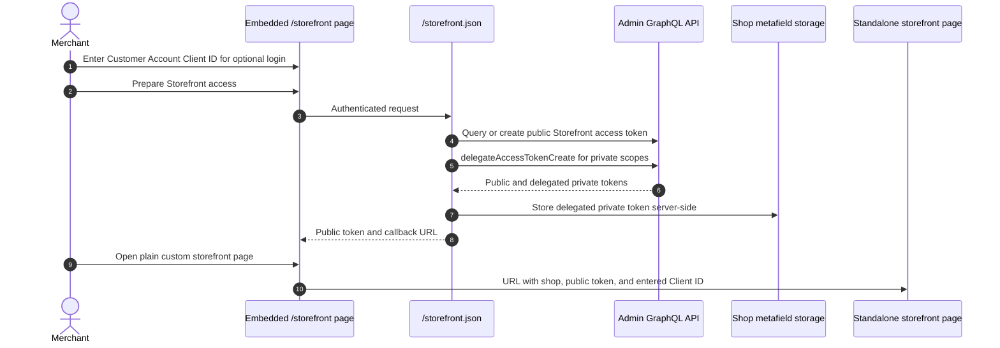
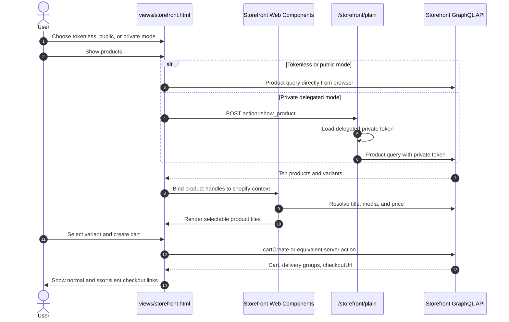
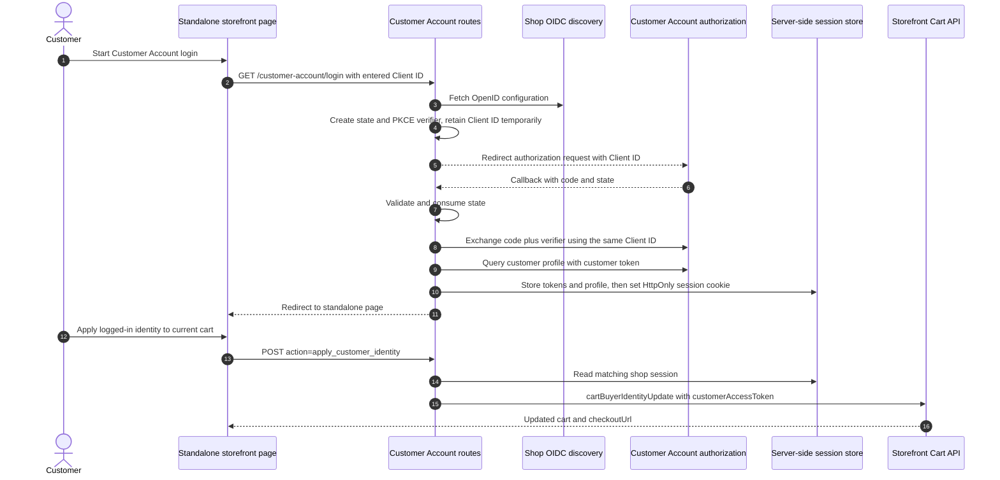

# Storefront API

## Purpose

The `/storefront` management page prepares Storefront API access, accepts an optional Customer Account API Client ID, and opens a standalone plain HTML storefront laboratory. The laboratory compares tokenless browser access, public Storefront token access, and server-side delegated private token access while exercising product queries, Cart API mutations, Storefront Web Components, and Customer Account API login.

## Runtime Locations

- The embedded management page creates tokens through the Admin API.
- The Customer Account API Client ID is entered in the management page and passed to the standalone page through its URL, without saving an app setting.
- `views/storefront.html` runs as a standalone browser page without App Bridge or the embedded App shell.
- Tokenless and public-token GraphQL calls go directly from the browser to Storefront API.
- Private delegated-token calls go through `/storefront/plain`; the token stays on the app server.
- Customer Account API discovery, PKCE callback exchange, and session storage run on the app server.

## Access Preparation

## Product and Cart Sequence

## Customer Login and Buyer Identity

## How It Works

The plain page defaults to public-token mode because password-protected development storefronts can reject tokenless catalog access with `Online Store channel is locked`. Public tokens are designed for browser use. Delegated private tokens are kept in a shop metafield accessible only to the server and are never injected into HTML.

The Cart API flow lets the user select one of ten products, create a cart, update buyer identity, add an editable delivery address, and choose a returned delivery option. The response's `checkoutUrl` is rendered as a link. A second link appends `sso=silent`, which asks checkout to use an active Customer Accounts browser session when available; this is independent of the cart's stored buyer identity.

Product tiles combine the explicit Storefront GraphQL response with Storefront Web Components. [`shopify-context`](https://shopify.dev/docs/api/storefront-web-components/components/shopify-context) establishes product context, [`shopify-data`](https://shopify.dev/docs/api/storefront-web-components/components/shopify-data) renders fields, [`shopify-media`](https://shopify.dev/docs/api/storefront-web-components/components/shopify-media) renders media, and [`shopify-money`](https://shopify.dev/docs/api/storefront-web-components/components/shopify-money) formats money. These components complement rather than replace the sample's hand-written Cart API mutations.

For Customer Account API setup, use the management page's **Headless** link to open `https://admin.shopify.com/store/{store-handle}/headless` for the current store. Create a storefront, open its Customer Account API settings, and use a public client. Enter its Client ID in this app's **Customer Account API client ID** field. In the same Headless storefront settings, register the app's `/customer-account/callback` URL as an allowed callback URL and the app's origin as a JavaScript origin; the management page displays both values. See the [official setup guide](https://shopify.dev/docs/storefronts/headless/building-with-the-customer-account-api/getting-started).

The Client ID identifies the headless customer-account integration and is separate from the app's Shopify API key and the Storefront access tokens. Token preparation doesn't generate it. The management page passes the entered value as `customer_account_client_id` in the standalone page URL. It isn't saved in a database or browser storage, and there is no environment-variable fallback; re-enter it after reloading the management page. Omitting it disables customer login but leaves the product and cart examples available.

The Customer Account API uses OpenID Connect discovery and authorization code flow with PKCE. The login request carries the entered Client ID, which the server temporarily retains with the pending OAuth state, PKCE verifier, and return URL. The callback consumes that state and uses the same Client ID for token exchange, keeping concurrent login requests independent. Unused pending state expires after ten minutes. The server stores the resulting customer access token behind an HttpOnly session cookie, then uses it only when the user explicitly applies the logged-in identity to a cart.

## Common Pitfalls

- Tokenless access can fail while the Online Store password is enabled; this does not prove the query is malformed.
- A public Storefront token must be created before public-token mode can work.
- Enter a Customer Account API Client ID for the same store as the plain storefront page, and register the displayed callback URL in that client's Headless settings. The former Customer Account Client ID environment variables are no longer read.
- Never expose a private delegated token in HTML, JavaScript, query strings, or browser storage.
- A Customer Account API authorization code has a different token prefix and purpose from its access token. Exchange the code before querying the profile.
- Customer Account API authorization headers and token formats must follow that API's specification; do not reuse Admin OAuth conventions.
- Login alone does not mutate an existing cart. Call [`cartBuyerIdentityUpdate`](https://shopify.dev/docs/api/storefront/unstable/mutations/cartBuyerIdentityUpdate) with the customer access token.
- Cart delivery options can change after identity or address updates. Render the latest options rather than assuming the first option.
- Market context such as country and language affects catalog, price, and delivery results.

## Key Terms

| Term | Meaning |
| --- | --- |
| Tokenless access | Supported Storefront API operations sent without an access-token header |
| Public Storefront token | Browser-safe token created for Storefront API access |
| Delegated private token | Server-only Storefront token with delegated scopes |
| Cart buyer identity | Email, country, company, or customer token associated with a cart |
| PKCE | Authorization-code protection using a verifier and derived challenge |
| Customer Account client ID | Identifier for the headless Customer Account API integration, separate from the app API key |
| Storefront Web Components | Shopify HTML custom elements that fetch and render storefront commerce data |

## Source Map

- [`app/pages/Storefront.jsx`](../app/pages/Storefront.jsx): token preparation and standalone-page link
- [`app/routes/storefront-json.jsx`](../app/routes/storefront-json.jsx): authenticated token-preparation endpoint
- [`app/routes/storefront-plain.jsx`](../app/routes/storefront-plain.jsx): standalone HTML and private-call route
- [`app/lib/storefront.server.js`](../app/lib/storefront.server.js): tokens, Storefront queries, and Cart API actions
- [`views/storefront.html`](../views/storefront.html): plain HTML UI, direct API calls, and web components
- [`app/routes/customer-account.login.jsx`](../app/routes/customer-account.login.jsx): Customer Account login start
- [`app/routes/customer-account.callback.jsx`](../app/routes/customer-account.callback.jsx): code callback
- [`app/routes/customer-account.session.jsx`](../app/routes/customer-account.session.jsx): browser session status
- [`app/routes/customer-account.logout.jsx`](../app/routes/customer-account.logout.jsx): local logout
- [`app/lib/customer-account.server.js`](../app/lib/customer-account.server.js): discovery, PKCE, token exchange, profile, and session

## Official Shopify References

- [Storefront API](https://shopify.dev/docs/api/storefront/unstable)
- [Storefront API access](https://shopify.dev/docs/api/usage/authentication#storefront-api-access-tokens)
- [Storefront Cart API](https://shopify.dev/docs/storefronts/headless/building-with-the-storefront-api/cart)
- [Storefront Web Components](https://shopify.dev/docs/api/storefront-web-components)
- [Customer Account API](https://shopify.dev/docs/api/customer/unstable)
- [Get started with Customer Account API](https://shopify.dev/docs/storefronts/headless/building-with-the-customer-account-api/getting-started)
- [Authenticate buyers in checkout](https://shopify.dev/docs/storefronts/headless/building-with-the-customer-account-api/checkout-authentication)
