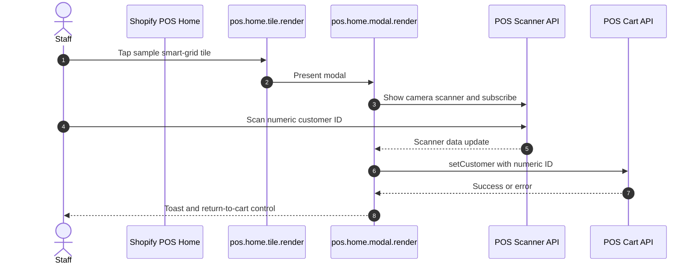
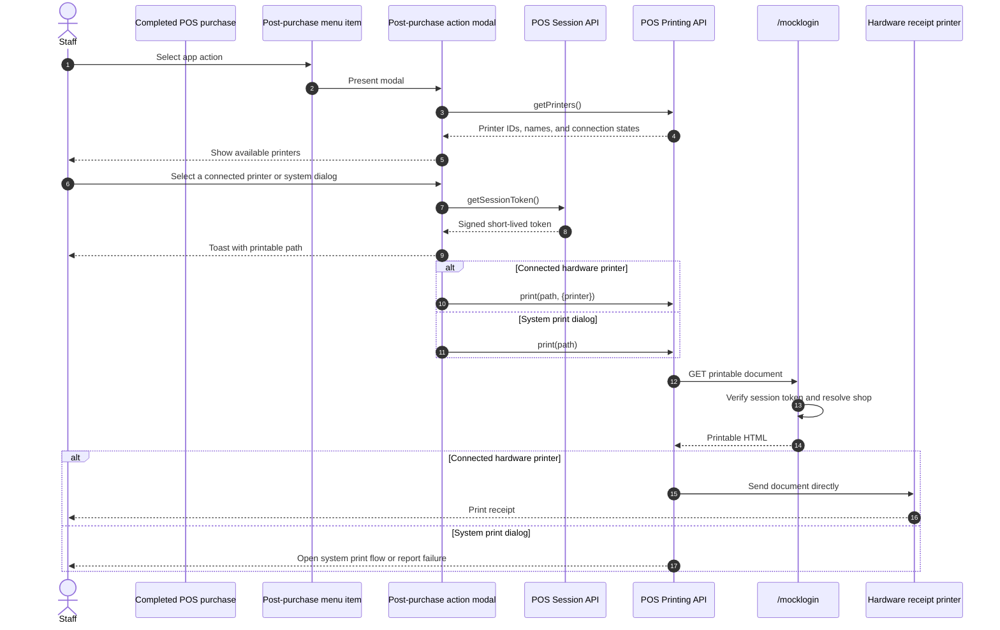

# POS UI

## Purpose

The `/posui` page documents a Shopify POS UI extension with two demonstrations: scanning a numeric Shopify customer ID into the current cart and printing an app-hosted authenticated document after a sale.

## Prerequisites

1. Install the [Shopify POS sales channel](https://apps.shopify.com/shopify-pos) in the store where this sample app is installed.
2. Install the Shopify POS mobile app for [iOS](https://apps.apple.com/us/app/shopify-point-of-sale-pos/id686830644) or [Android](https://play.google.com/store/apps/details?id=com.shopify.pos), then sign in to the same store with an authorized staff account.
3. Deploy the POS UI extension and add its smart-grid tile either in the mobile POS app or from the Shopify admin POS smart-grid editor. The editor URL follows this store-specific pattern: `https://admin.shopify.com/store/{store-handle}/apps/point-of-sale-channel/editor?currentEditor=pointOfSale&mode=sections`.

In the Shopify admin smart-grid editor, the tile is listed as **A Preact POS UI extension**, which comes from the extension description in `shopify.extension.toml`. The running tile itself is rendered by `Tile.jsx`, including its runtime heading and subheading.

## Runtime Locations

- The information page runs in the embedded Admin app.
- Extension modules run in isolated Web Worker-based runtimes inside Shopify POS on the configured tile, modal, menu-item, and post-purchase action targets.
- The camera scanner, cart, toast, session, and printing APIs are provided by the POS extension runtime.
- `/mocklogin` is rendered by the remote app server after verifying the POS session token.

## Scanner Sequence

## Printing Sequence

## How It Works

The Home tile calls [`shopify.action.presentModal()`](https://shopify.dev/docs/api/pos-ui-extensions/unstable/target-apis/standard-apis/action-api). The modal subscribes to scanner data, opens the camera, and passes a numeric scan to [`shopify.cart.setCustomer()`](https://shopify.dev/docs/api/pos-ui-extensions/unstable/target-apis/contextual-apis/cart-api). It unsubscribes and hides the scanner during cleanup.

After purchase, the action menu item opens its companion modal. The modal calls [`shopify.printing.getPrinters()`](https://shopify.dev/docs/api/pos-ui-extensions/unstable/target-apis/platform-apis/printing-api) and displays every discovered hardware printer with its connection state. Selecting a connected printer passes its reference to [`shopify.printing.print(path, {printer})`](https://shopify.dev/docs/api/pos-ui-extensions/unstable/target-apis/platform-apis/printing-api), which sends the HTML directly to the receipt printer without opening a system dialog. The system-dialog button calls [`shopify.printing.print(path)`](https://shopify.dev/docs/api/pos-ui-extensions/unstable/target-apis/platform-apis/printing-api) without a printer option and remains available as a fallback.

Both print paths obtain a fresh POS session token and include it in the `/mocklogin` URL. The server verifies the token before producing the document, so the printed page can identify the shop without embedding an Admin token. The extension uses the current Printing API on API version `2026-07`; it doesn't use the deprecated [`shopify.print`](https://shopify.dev/docs/api/pos-ui-extensions/unstable/target-apis/platform-apis/print-api) API.

In testing for this sample, the system print preview completed on iPad while iPhone remained at the loading/toast stage. A connected compatible hardware receipt printer provides a path that bypasses that system dialog. When [`getPrinters()`](https://shopify.dev/docs/api/pos-ui-extensions/unstable/target-apis/platform-apis/printing-api) returns no connected printer, the sample still depends on the device's system print behavior, so this change can't guarantee an iPhone preview without compatible printer hardware.

## Common Pitfalls

- Configure both an entry target and its companion modal target; a tile or menu item alone has nowhere to present the workflow.
- Scanner payloads are arbitrary strings. Validate the expected numeric customer ID before changing the cart.
- Always unsubscribe from scanner data and hide the camera when the modal closes.
- Get a fresh session token immediately before requesting the protected print document.
- Query-string tokens can appear in logs. This sample keeps the original demonstrative pattern; production designs should minimize token exposure and retention.
- [`getPrinters()`](https://shopify.dev/docs/api/pos-ui-extensions/unstable/target-apis/platform-apis/printing-api) lists hardware printers only. An empty array doesn't mean that the system print dialog is unavailable.
- Direct hardware printing accepts HTML and image content, but not PDF content. The sample's `/mocklogin` response is HTML.
- Printing depends on POS device capabilities, operating system behavior, and current API support. Handle rejected Promises and show a useful status.
- The app server must allow the POS print fetch path and verify the token without requiring embedded query HMAC parameters.

## Key Terms

| Term | Meaning |
| --- | --- |
| Smart grid tile | Entry point rendered on the POS Home screen |
| Smart-grid editor | Shopify POS channel editor used to add and arrange tiles outside the mobile POS app |
| Action menu item | Entry point attached to a POS workflow such as a completed purchase |
| Target API | POS-provided scanner, cart, session, printing, toast, or navigation capability |
| Session token | Short-lived signed token used to authenticate POS extension requests to the app server |
| Printable document | HTML URL loaded by the POS Printing API |
| Hardware printer | Receipt printer returned by [`getPrinters()`](https://shopify.dev/docs/api/pos-ui-extensions/unstable/target-apis/platform-apis/printing-api) and passed to [`print()`](https://shopify.dev/docs/api/pos-ui-extensions/unstable/target-apis/platform-apis/printing-api) for dialog-free direct printing |

## Source Map

- [`app/pages/PosUi.jsx`](../app/pages/PosUi.jsx): Admin explanation and test instructions
- [`app/routes/posui.jsx`](../app/routes/posui.jsx): embedded information route
- [`extensions/my-pos-ui-ext/shopify.extension.toml`](../extensions/my-pos-ui-ext/shopify.extension.toml): POS targets
- [`extensions/my-pos-ui-ext/src/Tile.jsx`](../extensions/my-pos-ui-ext/src/Tile.jsx): Home tile
- [`extensions/my-pos-ui-ext/src/Modal.jsx`](../extensions/my-pos-ui-ext/src/Modal.jsx): scanner and cart workflow
- [`extensions/my-pos-ui-ext/src/PostPurchaseAction.jsx`](../extensions/my-pos-ui-ext/src/PostPurchaseAction.jsx): post-purchase menu item
- [`extensions/my-pos-ui-ext/src/PostPurchaseActionModal.jsx`](../extensions/my-pos-ui-ext/src/PostPurchaseActionModal.jsx): authenticated printing workflow
- [`app/routes/mocklogin.jsx`](../app/routes/mocklogin.jsx): printable route
- [`app/lib/public-endpoints.server.js`](../app/lib/public-endpoints.server.js): session-token verification and printable HTML

## Official Shopify References

- [POS UI extensions](https://shopify.dev/docs/api/pos-ui-extensions/unstable)
- [POS Home screen targets](https://shopify.dev/docs/api/pos-ui-extensions/unstable/targets/home-screen)
- [POS post-purchase targets](https://shopify.dev/docs/api/pos-ui-extensions/unstable/targets/post-purchase)
- [Scanner API](https://shopify.dev/docs/api/pos-ui-extensions/unstable/target-apis/platform-apis/scanner-api)
- [Cart API](https://shopify.dev/docs/api/pos-ui-extensions/unstable/target-apis/contextual-apis/cart-api)
- [Session API](https://shopify.dev/docs/api/pos-ui-extensions/unstable/target-apis/standard-apis/session-api)
- [Printing API](https://shopify.dev/docs/api/pos-ui-extensions/unstable/target-apis/platform-apis/printing-api)
- [Direct hardware receipt printer changelog](https://shopify.dev/changelog/pos-ui-extensions-can-now-print-directly-to-hardware-receipt-printers)
- [Upgrade POS UI extensions to 2025-10](https://shopify.dev/docs/apps/build/pos/upgrading-to-2025-10)
