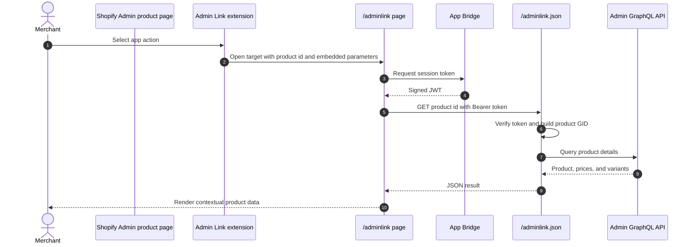

# Admin Link

## Purpose

The `/adminlink` sample connects contextual actions on Shopify Admin product and order detail pages to the app. The product action demonstrates how the destination page receives a resource ID and then loads protected product data through the app server.

## Runtime Locations

- Shopify Admin renders the Admin Link action.
- The link opens the embedded React Router page in the browser.
- The app server converts the product ID to a GraphQL global ID and calls Admin GraphQL.

## Request Sequence

## How It Works

The product extension targets `admin.product-details.action.link` and points to `app://adminlink`. Shopify resolves the app URL and appends context, including the selected resource ID. The order extension targets `admin.order-details.action.link` and routes to the order-management sample.

The page itself does not hold an Admin access token. It uses `authenticatedJson()` to send an App Bridge token to `/adminlink.json`; the server verifies it, loads the shop installation, and sends the `AdminLinkedProduct` query with the stored OAuth token.

## Common Pitfalls

- Admin Link targets and URLs must match the app's embedded setting. A non-embedded app requires an absolute `https` URL instead of an `app://` URL.
- Shopify can provide a numeric resource ID, while Admin GraphQL expects a global ID such as `gid://shopify/Product/...`.
- Returning an HTML error page to code expecting JSON produces `Unexpected token '<'`. Check status and content type before parsing.
- A successful page request does not prove the later JSON request was authenticated; inspect both hops.
- Do not expose the Admin OAuth token to the linked page.

## Key Terms

| Term | Meaning |
| --- | --- |
| Admin Link | An extension that adds a contextual link to a supported Shopify Admin resource page |
| Extension target | The named Shopify surface where an extension is mounted |
| `app://` URL | An embedded-app-relative target resolved by Shopify |
| GID | Shopify's GraphQL global identifier format |

## Source Map

- [`extensions/my-admin-link-product-details/shopify.extension.toml`](../extensions/my-admin-link-product-details/shopify.extension.toml): product action target
- [`extensions/my-admin-link-order-details/shopify.extension.toml`](../extensions/my-admin-link-order-details/shopify.extension.toml): order action target
- [`app/pages/AdminLink.jsx`](../app/pages/AdminLink.jsx): browser UI
- [`app/routes/adminlink.jsx`](../app/routes/adminlink.jsx): embedded page route
- [`app/routes/adminlink-json.jsx`](../app/routes/adminlink-json.jsx): authenticated data route
- [`app/lib/admin-link.server.js`](../app/lib/admin-link.server.js): Admin GraphQL query

## Official Shopify References

- [Admin UI extensions](https://shopify.dev/docs/api/admin-extensions/latest)
- [Admin extension targets](https://shopify.dev/docs/api/admin-extensions/latest/extension-targets)
- [GraphQL global IDs](https://shopify.dev/docs/api/usage/gids)
- [Admin GraphQL API](https://shopify.dev/docs/api/admin-graphql/latest)
