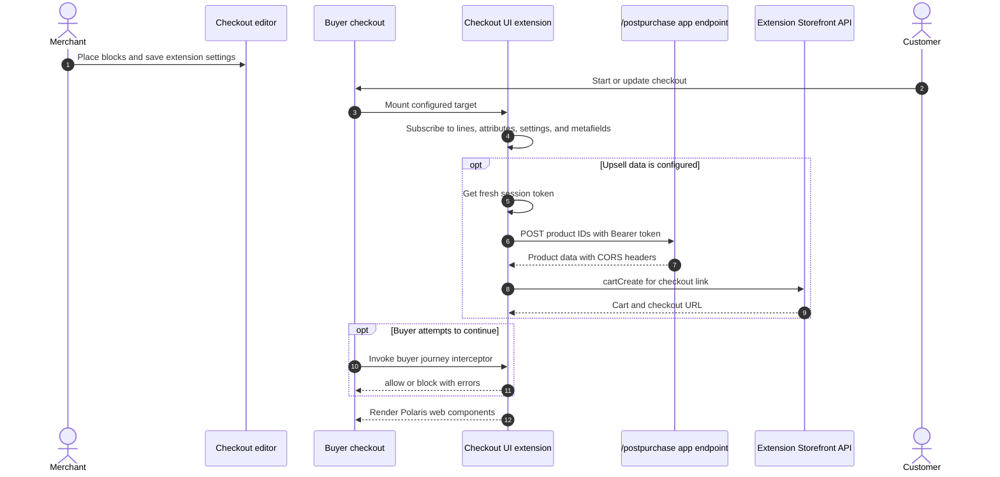

# Checkout UI

## Purpose

The `/checkoutui` page describes three Checkout UI extension packages. Together they demonstrate upsells, Storefront API access, app-server access, cart and checkout state subscriptions, customer review handling, address suggestions, buyer-journey blocking, cart-line changes, and Polaris web components rendered with Preact.

## Runtime Locations

- The management page runs inside the embedded app.
- Merchants place extension blocks and configure settings in the checkout editor.
- Extension modules run in Shopify's checkout extension runtime.
- Upsell and review flows call the remote app server with extension session tokens.

## Checkout Sequence

## Included Extension Packages

| Package | Targets and behavior |
| --- | --- |
| `my-checkout-ui-ext` | Dynamic upsell block, checkout validation, review UI, address autocomplete, Storefront API calls, cart changes, and app-server requests |
| `my-checkout-ui-ext-2` | Reactive metafield, cart-attribute, and discount-code samples at dynamic and static targets; includes alternate vanilla JavaScript source for comparison |
| `my-checkout-ui-ext-3` | Minimal block with `block_progress` capability used to demonstrate mobile checkout summary behavior without visible UI |

## How It Works

The primary upsell module reads `barebone_app.url` and `barebone_app_upsell.product_id` from the metafields declared in its TOML file. Because subscribed values can initially be empty and can update repeatedly, effects guard against missing values and must remain idempotent. Product data comes from the shared `/postpurchase` server endpoint. The module can then create a separate Storefront API cart link or add a selected variant to the active checkout.

The validation module uses checkout settings for an IP address, blocking message, and quantity threshold. Its buyer-journey interceptor returns `{behavior: 'block'}` only when a configured condition is active; otherwise it returns `{behavior: 'allow'}`. Address autocomplete is a target function that returns a bounded list of structured suggestions rather than rendering a normal block.

Capabilities in `shopify.extension.toml` are part of the security model. Code alone cannot grant network access, Storefront API access, or checkout blocking.

## Common Pitfalls

- Deploying an extension does not place a checkout block. Add it through the checkout editor.
- Availability of checkout customization features depends on the merchant's plan and the target capability.
- Extension data is reactive and may be empty on the first render. Avoid one-time assumptions and duplicate side effects.
- `buyerJourney.intercept` takes a callback. Passing a result object directly causes a runtime type error.
- A green informational message does not override a separately active blocker; derive UI text from the same state used by the interceptor.
- External `fetch` requires declared network access and a successful CORS preflight.
- Storefront API access in an extension is not an Admin API credential.
- Use Shopify's web components; arbitrary DOM UI is not the extension rendering contract.

## Key Terms

| Term | Meaning |
| --- | --- |
| Target | Named checkout location and lifecycle where a module executes |
| Static target | Fixed checkout location selected by the target definition |
| Dynamic block target | Merchant-placeable checkout block such as `purchase.checkout.block.render` |
| Capability | Explicit permission such as network access, Storefront API access, or block progress |
| Target API | Shopify-provided state and actions exposed to one extension target |
| Buyer journey interceptor | Callback that can allow or block progress when the capability permits it |

## Source Map

- [`app/pages/CheckoutUi.jsx`](../app/pages/CheckoutUi.jsx): management instructions
- [`app/routes/checkoutui.jsx`](../app/routes/checkoutui.jsx): embedded page route
- [`extensions/my-checkout-ui-ext/shopify.extension.toml`](../extensions/my-checkout-ui-ext/shopify.extension.toml): targets, capabilities, settings, and metafields
- [`extensions/my-checkout-ui-ext/src/Upsell.jsx`](../extensions/my-checkout-ui-ext/src/Upsell.jsx): upsell and cart behavior
- [`extensions/my-checkout-ui-ext/src/Review.jsx`](../extensions/my-checkout-ui-ext/src/Review.jsx): review and cart/customer state sample
- [`extensions/my-checkout-ui-ext/src/Validation.jsx`](../extensions/my-checkout-ui-ext/src/Validation.jsx): buyer-journey blocking and quantity handling
- [`extensions/my-checkout-ui-ext/src/Address.jsx`](../extensions/my-checkout-ui-ext/src/Address.jsx): address suggestions
- [`extensions/my-checkout-ui-ext-2/src/Checkout.jsx`](../extensions/my-checkout-ui-ext-2/src/Checkout.jsx): Preact reactive data sample
- [`extensions/my-checkout-ui-ext-2/src/Checkout.js`](../extensions/my-checkout-ui-ext-2/src/Checkout.js): vanilla JavaScript comparison
- [`extensions/my-checkout-ui-ext-3/src/Checkout.jsx`](../extensions/my-checkout-ui-ext-3/src/Checkout.jsx): minimal invisible block

## Official Shopify References

- [Checkout UI extensions](https://shopify.dev/docs/api/checkout-ui-extensions/latest)
- [Checkout block target](https://shopify.dev/docs/api/checkout-ui-extensions/latest/targets/checkout/block)
- [Checkout capabilities](https://shopify.dev/docs/apps/build/checkout/capabilities)
- [Block checkout progress](https://shopify.dev/docs/apps/build/checkout/capabilities#block-progress)
- [Storefront API access](https://shopify.dev/docs/apps/build/checkout/capabilities#storefront-api-access)
- [Network access](https://shopify.dev/docs/apps/build/checkout/capabilities#network-access)
- [Migrate Checkout UI extensions to web components](https://shopify.dev/docs/apps/build/checkout/migrate-to-web-components)
