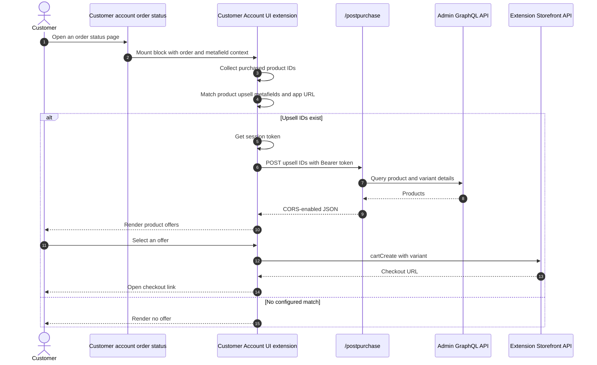

# Customer Account UI

## Purpose

The `/customeraccountui` sample adds an upsell block to an order status page in new customer accounts. It reads purchased-product metafields, securely asks the app server for upsell product details, and creates a new Storefront API cart and checkout link.

This UI extension is distinct from the Customer Account API OAuth flow demonstrated on the standalone Storefront page. The extension runs inside a Shopify customer-account surface; the Customer Account API is an external OIDC and GraphQL API for customer-owned data.

## Runtime Locations

- The information page runs in the embedded Admin app.
- The extension runs at `customer-account.order-status.block.render`.
- Product lookup runs on the app server with a verified extension session token.
- Cart creation runs through the Storefront API exposed by the extension runtime.

## Order Status Sequence

## How It Works

The extension's TOML file declares the order status target, Storefront API and network capabilities, and the product/shop metafields it needs. Purchased line products are compared with `targetId` values on `barebone_app_upsell.product_id` metafields. The matching metafield values identify the products to offer, while `barebone_app.url` identifies the app server.

The app server verifies the extension session token before querying Admin GraphQL. The extension never receives the stored Admin OAuth token. It uses its own target API to execute `cartCreate`, which returns the checkout link displayed to the customer.

## Common Pitfalls

- Product IDs can appear as GraphQL GIDs in order data and numeric owner IDs in metafield target data. Normalize before comparing.
- Metafield access must be declared in the extension TOML; creating a metafield definition alone is not enough.
- The extension must be added to the applicable customer-account page in the editor.
- Reactive order and metafield data can arrive after the initial render. Fetch only after all required values exist.
- Browser developer tools can show extension logs in a different execution context from the top page.
- Network access, CORS, session-token verification, and Storefront API access are independent requirements.

## Key Terms

| Term | Meaning |
| --- | --- |
| Customer Account UI extension | UI hosted by Shopify on customer-account pages |
| Order status target | Extension point associated with a customer's order status view |
| App metafield | Metafield data filtered and exposed to an extension according to configuration |
| Target ID | Resource owner identifier attached to an exposed metafield |
| Customer Account API | Separate OIDC/GraphQL API for authenticated customer-owned data |

## Source Map

- [`app/pages/CustomerAccountUi.jsx`](../app/pages/CustomerAccountUi.jsx): setup and testing instructions
- [`app/routes/customeraccountui.jsx`](../app/routes/customeraccountui.jsx): embedded management route
- [`extensions/my-customer-account-ui-ext/shopify.extension.toml`](../extensions/my-customer-account-ui-ext/shopify.extension.toml): target and capabilities
- [`extensions/my-customer-account-ui-ext/src/OrderStatusBlock.jsx`](../extensions/my-customer-account-ui-ext/src/OrderStatusBlock.jsx): order matching, server fetch, and cart creation
- [`app/lib/post-purchase.server.js`](../app/lib/post-purchase.server.js): shared authenticated product lookup
- [`server.mjs`](../server.mjs): CORS preflight handling

## Official Shopify References

- [Customer Account UI extensions](https://shopify.dev/docs/api/customer-account-ui-extensions/latest)
- [Order status targets](https://shopify.dev/docs/api/customer-account-ui-extensions/latest/targets/order-status)
- [Metafields API](https://shopify.dev/docs/api/customer-account-ui-extensions/latest/target-apis/order-apis/metafields-api)
- [Session Token API](https://shopify.dev/docs/api/customer-account-ui-extensions/latest/target-apis/platform-apis/session-token-api)
- [Storefront API target API](https://shopify.dev/docs/api/customer-account-ui-extensions/latest/target-apis/platform-apis/storefront-api)
- [Migrate Customer Account UI extensions to web components](https://shopify.dev/docs/apps/build/customer-accounts/migrate-to-web-components)
