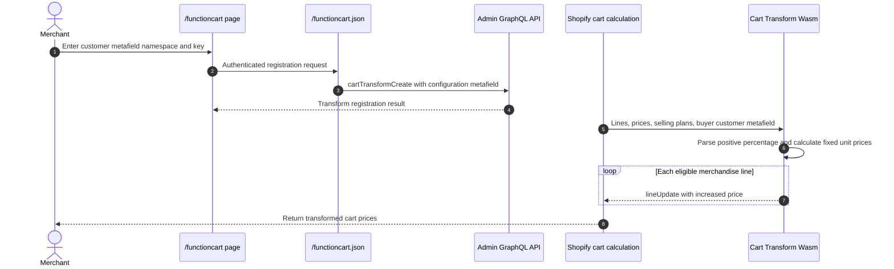

# Function Cart

## Purpose

The `/functioncart` sample registers a Cart Transform Function that increases eligible product prices by a percentage stored on the logged-in customer. It complements the discount sample: the Discount Function demonstrates a dynamic reduction, while this Cart Transform demonstrates a dynamic increase.

## Runtime Locations

- The embedded UI chooses the customer metafield namespace and key.
- The app server registers the Cart Transform through Admin GraphQL.
- Shopify executes the Rust/Wasm Function whenever it recalculates the cart.

## Registration and Execution

## How It Works

The app registers `my-function-cart-ext` and stores the selected namespace and key in `barebone_app_function_cart.customer_meta`. The Function input query uses that configuration to request the logged-in customer's metafield along with each cart line's current unit price and selling-plan state.

For a valid positive percentage, the Function calculates `price * (1 + percentage / 100)` and returns a fixed-price-per-unit line update for each eligible product variant. Lines with a selling plan are skipped so the sample does not overwrite subscription or other purchase-option pricing.

## Common Pitfalls

- Cart Transform changes are constrained by Shopify's API and merchant eligibility. They are not a general-purpose arbitrary pricing engine.
- The buyer must be associated with a customer whose configured metafield contains a parseable positive number.
- Cart Transform cannot use a negative fixed price to implement a normal discount. Use the Discount Function API for reductions.
- Money rounding and currency behavior require deliberate production rules.
- Shopify can invoke the Function during cart recalculation without the buyer first opening a cart page.
- Selling-plan lines are intentionally excluded in this sample.

## Key Terms

| Term | Meaning |
| --- | --- |
| Cart Transform | A Function API that can alter supported cart-line presentation and pricing properties |
| `lineUpdate` | The operation this sample returns for an eligible cart line |
| Fixed price per unit | A replacement unit price supplied by the transform operation |
| Selling plan | A purchase option such as a subscription with its own pricing behavior |

## Source Map

- [`app/pages/FunctionCart.jsx`](../app/pages/FunctionCart.jsx): registration UI
- [`app/routes/functioncart-json.jsx`](../app/routes/functioncart-json.jsx): authenticated endpoint
- [`app/lib/functions-samples.server.js`](../app/lib/functions-samples.server.js): `cartTransformCreate` mutation
- [`extensions/my-function-cart-ext/src/cart_transform_run.graphql`](../extensions/my-function-cart-ext/src/cart_transform_run.graphql): runtime input
- [`extensions/my-function-cart-ext/src/cart_transform_run.rs`](../extensions/my-function-cart-ext/src/cart_transform_run.rs): pricing logic and tests
- [`extensions/my-function-cart-ext/shopify.extension.toml`](../extensions/my-function-cart-ext/shopify.extension.toml): extension configuration

## Official Shopify References

- [Cart Transform Function API](https://shopify.dev/docs/api/functions/latest/cart-transform)
- [Create a cart transform](https://shopify.dev/docs/api/admin-graphql/latest/mutations/cartTransformCreate)
- [Shopify Functions](https://shopify.dev/docs/api/functions/latest)
