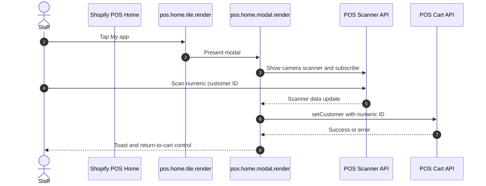
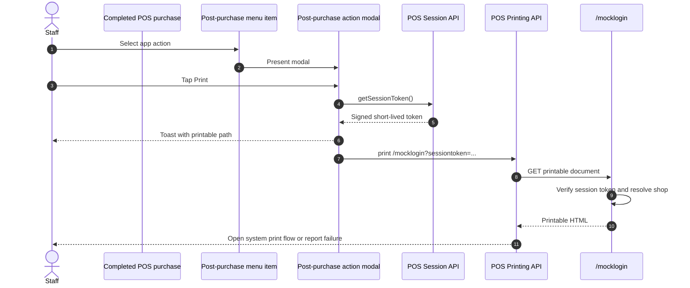

# POS UI

## Purpose

The `/posui` page documents a Shopify POS UI extension with two demonstrations: scanning a numeric Shopify customer ID into the current cart and printing an app-hosted authenticated document after a sale.

## Runtime Locations

- The information page runs in the embedded Admin app.
- Extension modules run inside Shopify POS on the configured tile, modal, menu-item, and post-purchase action targets.
- The camera scanner, cart, toast, session, and printing APIs are provided by the POS extension runtime.
- `/mocklogin` is rendered by the remote app server after verifying the POS session token.

## Scanner Sequence

## Printing Sequence

## How It Works

The Home tile calls `shopify.action.presentModal()`. The modal subscribes to scanner data, opens the camera, and passes a numeric scan to `shopify.cart.setCustomer()`. It unsubscribes and hides the scanner during cleanup.

After purchase, the action menu item opens its companion modal. The Print button obtains a fresh POS session token, includes it in the `/mocklogin` URL, and calls `shopify.printing.print()`. The server verifies the token before producing the document, so the printed page can identify the shop without embedding an Admin token.

In testing for this sample, the print preview completed on iPad while iPhone remained at the loading/toast stage. Treat this as observed device behavior, not as a guaranteed platform rule unless the current Printing API documentation states one.

## Common Pitfalls

- Configure both an entry target and its companion modal target; a tile or menu item alone has nowhere to present the workflow.
- Scanner payloads are arbitrary strings. Validate the expected numeric customer ID before changing the cart.
- Always unsubscribe from scanner data and hide the camera when the modal closes.
- Get a fresh session token immediately before requesting the protected print document.
- Query-string tokens can appear in logs. This sample keeps the original demonstrative pattern; production designs should minimize token exposure and retention.
- Printing depends on POS device capabilities, operating system behavior, and current API support. Handle rejected Promises and show a useful status.
- The app server must allow the POS print fetch path and verify the token without requiring embedded query HMAC parameters.

## Key Terms

| Term | Meaning |
| --- | --- |
| Smart grid tile | Entry point rendered on the POS Home screen |
| Action menu item | Entry point attached to a POS workflow such as a completed purchase |
| Target API | POS-provided scanner, cart, session, printing, toast, or navigation capability |
| Session token | Short-lived signed token used to authenticate POS extension requests to the app server |
| Printable document | HTML URL loaded by the POS Printing API |

## Source Map

- [`app/pages/PosUi.jsx`](../app/pages/PosUi.jsx): Admin explanation and test instructions
- [`app/routes/posui.jsx`](../app/routes/posui.jsx): embedded information route
- [`extensions/my-pos-ui-ext/shopify.extension.toml`](../extensions/my-pos-ui-ext/shopify.extension.toml): POS targets
- [`extensions/my-pos-ui-ext/src/Tile.jsx`](../extensions/my-pos-ui-ext/src/Tile.jsx): Home tile
- [`extensions/my-pos-ui-ext/src/Modal.jsx`](../extensions/my-pos-ui-ext/src/Modal.jsx): scanner and cart workflow
- [`extensions/my-pos-ui-ext/src/PostPurchaseAction.jsx`](../extensions/my-pos-ui-ext/src/PostPurchaseAction.jsx): post-purchase menu item
- [`extensions/my-pos-ui-ext/src/PostPurchaseActionModal.jsx`](../extensions/my-pos-ui-ext/src/PostPurchaseActionModal.jsx): authenticated printing workflow
- [`app/routes/mocklogin.jsx`](../app/routes/mocklogin.jsx): printable route
- [`app/lib/public-endpoints.server.js`](../app/lib/public-endpoints.server.js): session-token verification and printable HTML

## Official Shopify References

- [POS UI extensions](https://shopify.dev/docs/api/pos-ui-extensions/latest)
- [POS Home screen targets](https://shopify.dev/docs/api/pos-ui-extensions/latest/targets/home-screen)
- [POS post-purchase targets](https://shopify.dev/docs/api/pos-ui-extensions/latest/targets/post-purchase)
- [Scanner API](https://shopify.dev/docs/api/pos-ui-extensions/latest/target-apis/platform-apis/scanner-api)
- [Cart API](https://shopify.dev/docs/api/pos-ui-extensions/latest/target-apis/contextual-apis/cart-api)
- [Session API](https://shopify.dev/docs/api/pos-ui-extensions/latest/target-apis/standard-apis/session-api)
- [Print API](https://shopify.dev/docs/api/pos-ui-extensions/latest/target-apis/platform-apis/print-api)
- [Upgrade POS UI extensions to 2025-10](https://shopify.dev/docs/apps/build/pos/upgrading-to-2025-10)
