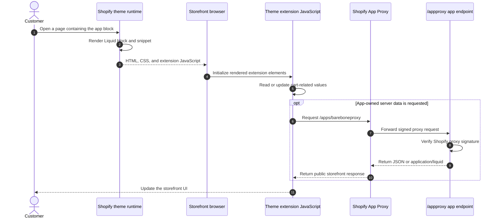

# Theme App Extension

## Purpose

The `/themeapp` page explains and configures the theme app extension sample. The extension demonstrates app blocks, app embed blocks, Liquid rendering, storefront JavaScript, line-item properties, cart attributes and notes, custom pixel events, and a signed App Proxy request.

## Runtime Locations

- The management page runs in the embedded Admin app.
- Liquid blocks render in Shopify's Online Store theme runtime.
- `barebone.js` runs in the customer's storefront browser.
- App Proxy verification and private server logic run on the remote app server.

## Storefront Sequence

## How It Works

Theme app extensions package blocks, snippets, JavaScript, CSS, and static assets. Merchants add app blocks or enable app embeds in the theme editor without editing theme source manually.

The App Proxy gives the storefront a stable path under the shop domain. Shopify forwards requests from that path to `/appproxy` and signs the forwarded parameters. The server must verify the signature before using the supplied shop identity. A proxy endpoint is still publicly reachable through the storefront, so its response must be safe for customers to read.

## Common Pitfalls

- Deploying an extension does not automatically add its block to a theme; the merchant must place or enable it.
- App blocks and app embeds have different placement and lifecycle behavior.
- App Proxy verification differs from webhook HMAC verification; use the algorithm for the request type.
- Never expose Admin tokens or private merchant data through an App Proxy response.
- Theme JavaScript can run more than once in editor or section-rendering flows. Initialization should be idempotent.
- Cart attributes, line-item properties, and cart notes are separate data locations with different scopes.

## Key Terms

| Term | Meaning |
| --- | --- |
| App block | Merchant-placeable Liquid content rendered inside compatible theme sections |
| App embed block | Theme-level functionality that can be enabled without occupying a section block slot |
| App Proxy | A shop-domain URL that Shopify signs and forwards to an app endpoint |
| Line-item property | Custom data attached to one cart line |
| Cart attribute | Custom key/value data attached to the cart |
| Cart note | Customer or app text attached to the cart/order |

## Source Map

- [`app/pages/ThemeApp.jsx`](../app/pages/ThemeApp.jsx): Admin instructions and links
- [`app/routes/themeapp.jsx`](../app/routes/themeapp.jsx): embedded management route
- [`extensions/my-theme-app-ext/blocks/`](../extensions/my-theme-app-ext/blocks): theme blocks and app embeds
- [`extensions/my-theme-app-ext/snippets/barebone_snippet.liquid`](../extensions/my-theme-app-ext/snippets/barebone_snippet.liquid): shared Liquid snippet
- [`extensions/my-theme-app-ext/assets/barebone.js`](../extensions/my-theme-app-ext/assets/barebone.js): storefront behavior
- [`extensions/my-theme-app-ext/assets/barebone.css`](../extensions/my-theme-app-ext/assets/barebone.css): extension stylesheet
- [`app/routes/appproxy.jsx`](../app/routes/appproxy.jsx): proxy route
- [`app/lib/public-endpoints.server.js`](../app/lib/public-endpoints.server.js): App Proxy verification and response logic

## Official Shopify References

- [Theme app extensions](https://shopify.dev/docs/apps/build/online-store/theme-app-extensions)
- [App blocks for themes](https://shopify.dev/docs/apps/build/online-store/theme-app-extensions/configuration#app-blocks-for-themes)
- [App embed blocks](https://shopify.dev/docs/apps/build/online-store/theme-app-extensions/configuration#app-embed-blocks)
- [App proxies](https://shopify.dev/docs/apps/build/online-store/app-proxies)
- [Line item properties](https://shopify.dev/docs/storefronts/themes/architecture/templates/product/overview#line-item-properties)
- [Cart notes and attributes](https://shopify.dev/docs/storefronts/themes/architecture/templates/cart#support-cart-notes-and-attributes)
