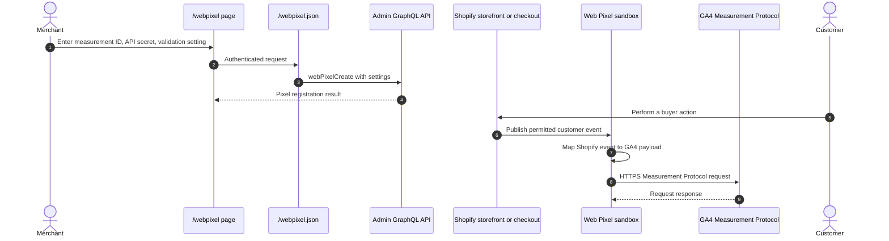

# Web Pixel

## Purpose

The `/webpixel` sample registers a custom Web Pixel and forwards selected standard customer events to Google Analytics 4 through the Measurement Protocol.

## Runtime Locations

- The management UI runs in the embedded Admin browser.
- The app server registers pixel settings through Admin GraphQL.
- The extension runs in Shopify's customer-events sandbox on buyer-facing pages.
- Measurement requests go from the pixel runtime to Google's GA4 endpoint.

## Registration and Event Sequence

## How It Works

The Admin page sends settings to the server, which calls `webPixelCreate`. Shopify then supplies those settings to the deployed extension. The pixel subscribes to customer events, maps supported Shopify payloads into GA4 event parameters, and sends them with `fetch`, including `keepalive` where supported.

The extension explicitly declares its customer privacy behavior. Event availability and field visibility depend on Shopify's pixel sandbox, consent state, and the surface that emitted the event.

## Common Pitfalls

- A successful `webPixelCreate` response proves registration, not that GA4 accepted a later event.
- Pixel code runs in a sandbox, not as unrestricted theme JavaScript. DOM and browser APIs are limited.
- Browser console output can be difficult to find because the extension runs in an isolated context.
- Consent and regional privacy rules can prevent or delay events.
- Measurement IDs and API secrets are pixel settings visible to the pixel runtime; do not treat them as server-only credentials.
- Validate both the request payload and GA4 DebugView or Realtime reports when troubleshooting.

## Key Terms

| Term | Meaning |
| --- | --- |
| Web Pixel | A Shopify-managed analytics extension running in the customer-events sandbox |
| Customer event | A standardized event published by Shopify, such as checkout or cart activity |
| Measurement Protocol | Google's HTTP interface for sending GA4 events |
| Pixel settings | Merchant-configured values passed to the extension by Shopify |
| Customer privacy | Consent and data-processing rules controlling pixel activation and data access |

## Source Map

- [`app/pages/WebPixel.jsx`](../app/pages/WebPixel.jsx): registration UI
- [`app/routes/webpixel-json.jsx`](../app/routes/webpixel-json.jsx): authenticated route
- [`app/lib/web-pixel.server.js`](../app/lib/web-pixel.server.js): Admin GraphQL registration
- [`extensions/my-web-pixel-ext/src/index.js`](../extensions/my-web-pixel-ext/src/index.js): event subscriptions
- [`extensions/my-web-pixel-ext/src/ga4.js`](../extensions/my-web-pixel-ext/src/ga4.js): GA4 payload conversion and delivery
- [`extensions/my-web-pixel-ext/src/index.test.js`](../extensions/my-web-pixel-ext/src/index.test.js): pixel behavior tests
- [`extensions/my-web-pixel-ext/shopify.extension.toml`](../extensions/my-web-pixel-ext/shopify.extension.toml): settings schema and privacy declaration

## Official Shopify References

- [Web Pixels API](https://shopify.dev/docs/api/web-pixels-api)
- [Create a custom pixel](https://shopify.dev/docs/apps/build/marketing-analytics/pixels)
- [Customer events reference](https://shopify.dev/docs/api/web-pixels-api/standard-events)
- [Web pixel privacy settings](https://shopify.dev/docs/apps/build/marketing-analytics/pixels#requesting-consent)
